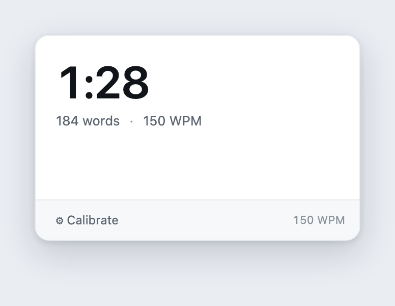

**Short on time? Here's the whole idea:** the reason most "I'm going to build my own tool" projects die isn't the building (Claude Code handles that), it's everything *after*: hosting, deploying, a domain, and a server you have to keep alive. A Chrome extension skips all of that, because it runs in the browser you already live in and you "deploy" it to yourself in about thirty seconds. That makes it the best possible first piece of software for a marketer. Below, I build one I actually use every week, start to finish, so you walk away with the repeatable workflow of how to do it yourself.

---

You've probably heard the line by now: *you can build real software with Claude Code now.* It's true. I've watched non-technical marketers describe a tool out loud and have a working version a few minutes later.

But then they hit the wall nobody warns them about.

Because the second you build *real software*, whether that's a little web app, a dashboard, or a tool you want to actually use tomorrow, a pile of unglamorous questions lands on your desk. Where do I host this? How do I deploy it? Do I need version control? A domain? A server that stays up while I sleep? None of that is *building*. It's the tax you pay to put something you made somewhere you (and maybe other people) can use it. So the project stalls, the tab gets closed, and "I built a tool" becomes "I tried building a tool once."

I want to show you the on-ramp that circumvents that whole piece of the process.

## Why a Chrome extension is the right first build

There's one type of software that's more useful than you think and doesn't have any of those deployment headaches at all: a Chrome extension.

Think about how much of you day you spend in a browser, then think about all the things a piece of software embedded in that browser could help you with. And if you're just running it for yourself, you don't need to find a hosting company, wire up a deploy pipeline, no need to buy a domain, and no server humming away in the background. You build a folder of files, you load that folder into Chrome, and it's running, just for you, right now, in the browser you have open all day anyway.

An important caveat is this is for tools that you will use on your own, not for anything you need to ship to your team or anything like that. However, this still covers a huge amount of potential tools.

## The workflow is the actual lesson

This post is just one particular example of a tool I built for _me_, but it will help you learn the loop that you'll go through to build your own personal piece of software.

Here's the whole workflow:

1. **Brainstorm a problem you have.** Something small and annoying you do by hand, over and over.
2. **Ask: does this problem live in the browser?** If the thing you want to act on is on a web page (text, a table, a list), an extension fits.
3. **Describe it to Claude Code.** You describe the *behavior* you want, and Claude writes the manifest, the popup, and the code that reads the page. You don't.
4. **Load your extension into Chrome, test, iterate.** See it run, fix what's off, and repeat until it's right.

That's it. That's the same four steps for every extension you will ever build. The rest of this post is just one trip through this loop with a real tool, so you can watch each step happen. Read it once and you own the pattern.

## Build-along: a script timer that estimates voiceover length

**My actual problem.** I write a lot of video scripts, and every single time, the one thing I need to know is this: *how long will this take to read aloud?* A script that times out to four minutes of voiceover is a very different video than one that runs nine. Counting words and doing the math in my head or pasting my script into a sketchy script timer website is one of those tiny, constant annoyances.

**Does it live in the browser?** Yes. The script text is right there on the page, in a Google Doc, a Notion page, wherever I drafted it.

### Step 1: Describe it to Claude Code

This step doesn't involve any code, it's just describing to Claude Code in detail, what you want to happen. Notice this whole prompt is mostly behavior with one bit of product thinking, with exactly zero specification of how to build any of it:

> *"Let's build a chrome extension that lives in the browser bar. This extension, when clicked, will calculate the approximate script time that it would take for the selected text to be read out loud, in a video or voiceover. We'll want to figure out some way for the user to calibrate their pacing (maybe a sample sentence for them to read with a spacebar press to start and stop a clock, which automatically calculates their reading rate and applies it to the extension). But we'll also want to ship a 'standard' reading rate to start. Ask me questions one at a time about this until you feel you understand me and are ready to start building."*

That last sentence is a move I use on almost everything now: *ask me questions one at a time.* Instead of guessing and immediately generating, Claude interviewed me first, one question at a time, about the details I hadn't thought through. *Then* it built.

### Step 2: What Claude Code builds

A couple minutes later, there's a folder of files and Claude Code built exactly what I'd described: a tool that uses a sensible **standard rate to start** (150 words per minute) so it's useful the instant it's installed, plus the **calibration** screen I'd asked about. That screen shows you three short passages. You read each one aloud and tap the spacebar to start and stop, and it averages your real pace and remembers it. One touch I *didn't* ask for but it added anyway: it also adds little pauses for commas, periods, and paragraph breaks, because that's how people actually read aloud.

You do not need to understand any of those files, and I mean that. You can open them and look if you're curious, but you never write or edit them by hand. Claude handles the structure, and you handle whether the thing is actually useful. If that feels uncomfortable, the discomfort fades fast the first time you watch it just *work*.

### Step 3: Load the extension into Chrome (the payoff)

This is the beat that replaces hosting, deploying, and DevOps with about thirty seconds of clicking. To actually get this extension running in Chrome:

1. Open `chrome://extensions` in your address bar.
2. Toggle **Developer mode** on (top-right corner).
3. Click **Load unpacked**.
4. Select the folder Claude Code created.

That's the deploy. The extension is now in your toolbar, and you can pin it there so the icon is always available. That's literally the deployment step!

### Step 4: Test and iterate

Once our extension is living in Chrome, this is where testing becomes important. I actually ran into a pretty major issue the first time I tried to run this extension.

I highlighted a script I had written in a Google Doc, clicked the icon to trigger the extension, and the extension told me that nothing was selected.

Apparently Google Docs renders its text in a way that hides your selection from the normal "what's highlighted on this page" trick extensions rely on. So I did exactly what you'd do. I described the symptom and handed the problem back to Claude:

> *"Yeah it doesn't seem to be able to capture Google Docs selections at all. Can you do some online research and see if there's a special workaround or other permissions we need?"*

Claude researched it, confirmed the limitation, and shipped a clean fallback: a **"Use clipboard text"** button. On a stubborn page like Google Docs, you copy the text first (⌘C), click the extension, and it reads from your clipboard instead of the selection. The empty state even prompts you to do exactly that. Just like that, our first hiccup was solved, just by describing what was broken.

As I was testing, I also realized it was cumbersome to keep mousing up to the icon and clicking on it, so I asked Claude to add a shortcut and now `⌘+Shift+0` (or `Ctrl+Shift+0` on Windows) pops it open from anywhere.

That whole arc (build, hit a real wall, describe the wall, and get a fix) is the loop doing its job. Testing and iterating is how the loop is supposed to work. Claude won't always nail it on the first try, and you shouldn't expect it to. But if you're testing the output and providing feedback, you'll be surprised how quickly you can get a newly-built piece of software up and running.

**The result:** a tool I use every week, built in about 15 minutes afternoon and living in my browser, that cost exactly nothing to "deploy."

## What you can build next (same four steps)

Now that you have the loop, you can use these *exact same four steps* with whatever problem you're trying to solve. Here's a few ideas:

- **One-click structured-data export.** Pull a competitor's pricing table, a SERP, or any list off a page into clean CSV or JSON.
- **One-click save-to-Obsidian (or Notion).** Grab the current page as clean markdown and drop it straight into your notes or vault, a swipe file that fills itself.
- **A reading-level checker.** Run it on any draft sitting in your browser and get a grade level back.
- **A "strip tracking params" share button.** Clean the `utm_` clutter off a URL before you paste it anywhere.
- **Highlight-and-define for your brand's terms.** Select a word and get your team's canonical definition.

## Where this stops

Like we talked about before, this works best for _personal_ software. If you start to send this around to your team, updates get more complicated or you get to the point where you're dealing with privacy policies, the Chrome Web Store and so much more.

Secondly, you're not going to one-shot even something simple, this process still relies on a bit of testing and iteration. But, to me at least, that's sort of the fun part of building software.

## The actual point

Building one small tool changes how you see what's possible. You stop being someone who *uses* software and start being someone who can bend it to your own workflow. That shift is worth more than any single extension, and a Chrome extension is the cheapest place to buy it.

If you want to clone the finished script timer and test it out for yourself, [it's on GitHub](https://github.com/kkoppenhaver/script-timer-extension). Load it unpacked and you've got the whole thing running in a couple of minutes. (And you can even have Claude help you pull it down and install it for you!)

And if this is your first time really *building* with Claude Code rather than just chatting with it, here are a couple of next steps. The [tricks I wish I'd known sooner](/blog/claude-code-tricks-i-wish-id-known-sooner) will save you some early friction, and if you're fuzzy on how skills fit into all this, start with [what skills are and how they work](/blog/what-are-skills). Once you've built one tool, the next ones get easier every time.
