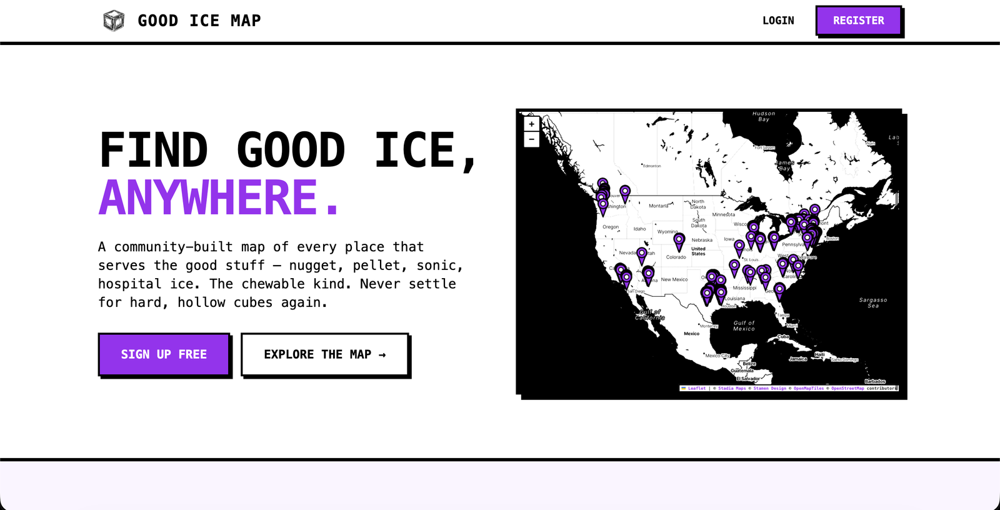
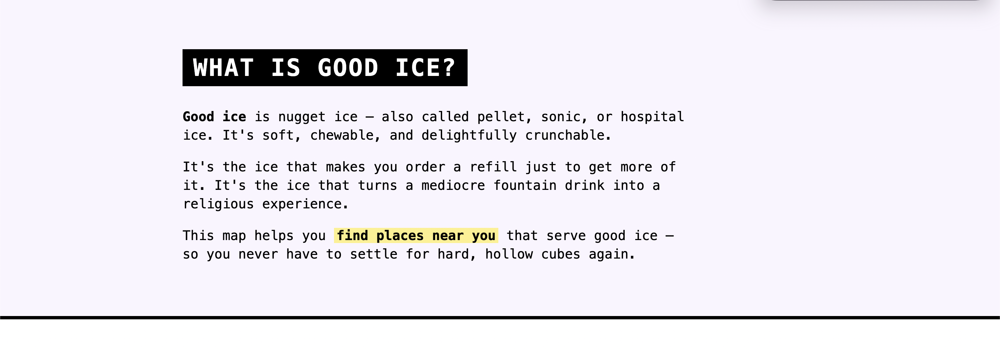

I built [Good Ice Map](https://goodicemap.com) a few months ago. It does one thing: shows a map of every* place that serves nugget ice (the soft, chewable kind, also called pellet, sonic, or hospital ice). You click a pin, see what real humans have rated the ice, and add your own.

The site was live, but every time someone asked me what it was, I had to send them to a URL that, if they weren't already logged in, gave them a login form and zero context. The product page for Good Ice Map *was* the map. If you didn't already know what the map was for, you bounced.

The fix was obvious. We needed a homepage. And since we already had the design language around the site, I decided to see if Claude Code could put one together for me.

With one careful prompt and a bit of feedback, I got to the version of the landing page that's now live in just over 20 minutes (21:42 to be exact). Here's exactly what how it went..

## The first prompt is the whole game

Most of the work in this build happened in a single message. Here's what I typed into Claude Code, sitting in the project directory:

> We need to build a landing page for the site that talks about what the site is and what it does. Research the project and make sure to use the same styles that we're already using in the project, as well as the information you can find out in the codebase. And ask me questions one at a time until you feel you have enough to start building.

There are three key things in that initial prompt that are important: The goal (build a landing page), the constraint (match the existing styles), and the instruction that did most of the heavy lifting: "ask me questions one at a time".

That last bit is the one I'd most underrated when I started using Claude Code for this kind of work. Without it, you get one of two outcomes. Either Claude builds the wrong thing because it had to guess at decisions you should've made, or Claude asks you a giant batched list of questions and you have to feed back all the answers at once, and make it clear which answer responds to each question. The "one question at a time" request turns the whole thing into a manageable conversation.

## Six small decisions before any code got written

For the next few minutes, Claude asked me questions and I answered them:

1. **What about logged-in users?** Do they see the landing page or skip straight to the map? (Answer: skip to the map. They already know what the site is.)
2. **Should we gate the map behind signup?** (No. The whole project is community-built. I'm not going to make people register just to look at the map. Let them click through, and if they want to add a location, *then* they sign up.)
3. **Should we feature any specific chains we know serve good ice?** (No. We don't have any pre-seeded data, and I don't want to play favorites.)
4. **How should we display stats (locations, ratings, contributors)?** (Show the real numbers, even if they're low. And include a callout that we're always accepting contributions.)
5. **What images?** (User-submitted photos. Real ice from real users.)
6. **What's the headline?** (I gave it: "Find good ice, anywhere.")

That's the entire planning phase. Six questions, six short answers, no code yet. By the time we were done, the page had its instructions: route logged-in users to the map, don't gate the project, show real data, use community photos for the gallery, and lead with "Find good ice, anywhere."

## Then Claude built it. 13 minutes later.

I said "yes, let's do it" at the end of the question round. Thirteen minutes after that, Claude was done. There was a full landing page running locally: hero, "what is good ice" explainer, three-step how-it-works section, embedded map preview, photo gallery, stats block, and footer.

It wasn't perfect. There was a placeholder box in the hero where a map screenshot should go. The photo gallery had a callout that read "A map of the good stuff," which felt like it was trying too hard. And the existing app still had a "What is Good Ice?" welcome modal popping up when you opened the map view, which was now redundant since the landing page covered that explainer in more depth.

So I sent one iteration prompt:

> Let's remove the modal now that we have the landing page? Can we also include a screenshot of the map as the hero graphic instead of the box we have there now? Let's please also remove the "A map of the good stuff" callout

Three subtractive asks in one message. Four minutes later, I told Claude to push the PR up to GitHub and I deployed it. 21 minutes and 42 seconds end-to-end.

The page that came out the other end. Live at <a href="https://goodicemap.com">goodicemap.com</a>.

There was one specific moment that surprised me: Claude picked up the existing brutalist style cues (monospace, thick black borders, the highlight-as-marker treatment) and reused them in the explainer copy. The "What is Good Ice?" section is three short paragraphs in the same voice as the rest of the app, with a yellow highlight on the phrase "find places near you" that I'd never thought to add but immediately recognized as on-brand.

Same brutalist treatment as the rest of the app. The yellow highlight is the kind of touch that would've taken a designer five minutes and me an hour.

The Q&A round about photos paid off in the gallery section too. Instead of stock images of glasses of ice or generic "happy customer" shots, the receipts gallery pulls real submissions from real users. That's only possible because we made the call up front to use community photos rather than letting Claude reach for whatever placeholder it would've defaulted to.

"Real photos from the community. No good ice, no submission." All eight tiles are real user submissions pulled live from the database.

## The pattern: brief heavy, iterate light

This is the second build like this I've watched come together this month, and the same shape held up both times. Big upfront prompt with a small iteration round at the end. It's the inverse of how most people use AI tools, which is "type something vague and refine until it's right." That works for one-off messages in a chatbot, but not as well for building things with AI.

When you give Claude Code enough context up front (the project, the existing styles, the ask, plus "ask me questions one at a time"), a lot of the hard work is done by the time it touches a file. The iteration at the end isn't where the design happens. It's where you remove the things you didn't realize you didn't want.

## What 21 minutes doesn't get you

The page is real and you can see it at [goodicemap.com](https://goodicemap.com). But there are a couple of things the build didn't catch, and I want to be honest about them because I think this is the part most "I built X in 20 minutes" posts skip.

First, the stats block at the bottom of the page (locations, ratings, contributors) shows stats that are pulled directly from the database. These should _probably_ be cached. If the site ever gets hugely popular, we'll have to revisit this, but this is why manual QA as well as a code review step is important.

Second, the page has no `<meta name="description">` or Open Graph tags. If someone shares goodicemap.com on Twitter or in Slack, the link preview is going to look like nothing. Basic SEO metadata is essential for the public face of a project, and Claude didn't add it because I didn't ask for it.

I caught both of those during a code review *after* the PR was already up. Neither broke the page, but both are real things I needed to fix.

Twenty-one minutes gets you a working, on-brand, deployed landing page. It does not automatically give you query caching, SEO metadata, an accessibility audit, analytics, or polished social-share previews. You still have to know to ask. I'd say it's much closer to a real launch than a prototype, but it isn't the finished product.

## Stopwatch versus wall clock

The session ran from 8:21pm to 9:03pm, about 42 minutes of real-world time. The stopwatch said 21:42. The difference is that for big chunks of those 42 minutes, Claude was working and I wasn't at the keyboard. I made coffee. I checked Slack. I wandered off and came back.

That's part of why this kind of build feels different from any other tool I've reached for. Claude Code being fast isn't really the point. What changes how I work is that Claude Code keeps building while I do something else. The way I now ship small marketing assets is "set Claude up well, and then pop in to make decisions when it asks." Most of my time gets spent on the decisions. Almost none of it gets spent on the building.

## Try it on something that's been sitting in your "I should build that" pile

If you have a project, a side hustle, an internal tool, or anything else that's been live for months without a marketing page, this is one of the cleanest entry points I know of into Claude Code. You don't need to know how to code. You need to be able to point Claude at the project, write one careful prompt, and answer questions.

Start a session in the project directory. Use the same first prompt I used (or a version of it). Specifically include "ask me questions one at a time." That single instruction will save you from the most common failure mode, which is Claude guessing wrong about a decision only you can make.

A lot of the speed in this build came from Claude being able to read the project's existing styles directly out of the codebase. If you don't have that, you have two clean options. If you have a brand somewhere (a website, a logo, social profiles), spend twenty minutes [building a brand guide with Claude Code](/blog/create-a-brand-guide-with-devtools-mcp/) first. That gives Claude the same kind of reusable reference my Laravel app gave it. If you don't have a brand at all yet, the [built-in `/frontend-design` skill](/blog/what-are-skills/) is the escape hatch. It gives Claude more capabilities to build interesting front ends instead of shipping something generic.

Now go build your first landing page!
