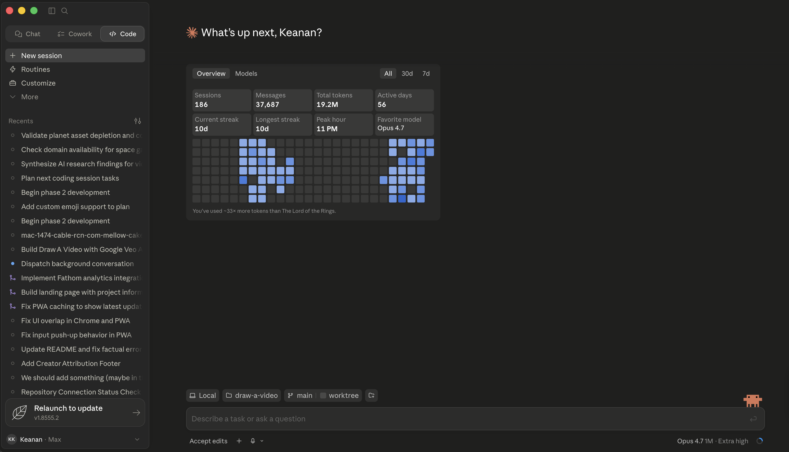
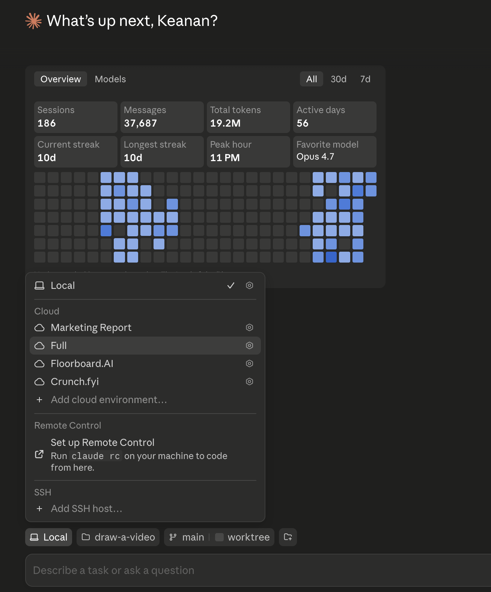
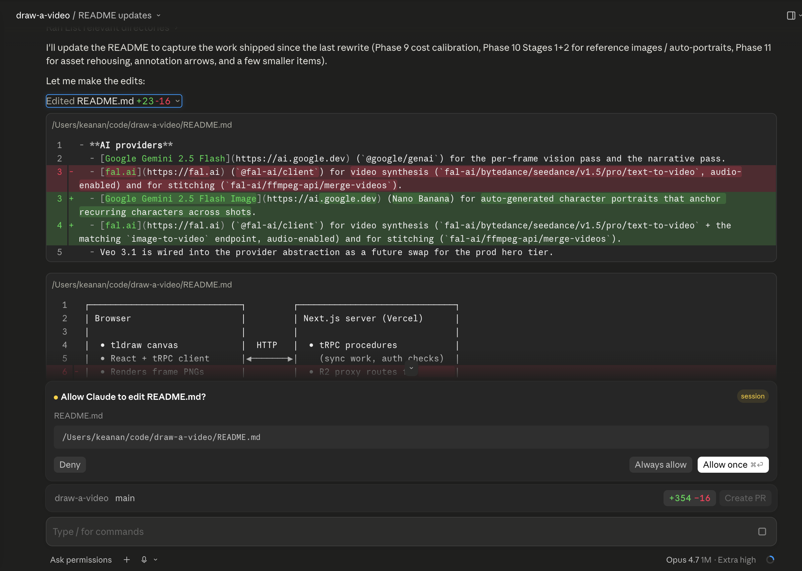

**Short on time? Here's my recommendation:** if you're a marketer trying Claude Code for the first time, start with the Desktop app, not the terminal. It installs like any other app, it shows you every change before it touches a single file, and it does just about everything you'll actually need (including having a terminal built in). That's the headline. The rest of this post is the full walkthrough for when you're ready for it.

---

Every time I told someone they should try Claude Code, I had to add an asterisk because *it lived in the terminal.* And I'd watch the same thing happen: the nod got a little slower, the enthusiasm cooled a notch, and I could tell they'd already filed it under "things for the developers."

I get it. I wrote a whole post about [why the terminal isn't as scary as it looks](/blog/dont-be-scared-of-the-terminal/), and I still believe that. But "not as scary as it looks" is a harder sell than "here's an app, double-click it."

So I was very happy when Anthropic shipped a real Desktop app for Claude that included Claude Code. In this walkthrough, we'll take a look at what the app is, how to install it, what the first run actually looks like, and the marketing workflows it unlocks for anyone who never wanted to open a terminal in the first place.

## What Claude Code Desktop actually is

The Claude Desktop app has three tabs across the top, and the distinction matters because it's easy to land in the wrong one:

- **Chat** is general conversation, basically claude.ai in a window. It can't touch your files.
- **Cowork** is an autonomous agent that works on tasks in the cloud while you do other things.
- **Code** is the one we care about. It's Claude Code with direct access to the files on your machine, and you approve each change as it happens.

Everything below lives in the **Code** tab.

The important thing to understand is that this isn't a watered-down version of the "real" Claude Code. It runs the same engine as the terminal version, just with a graphical interface wrapped around it. This means you have access to the same [CLAUDE.md files](/blog/the-claude-md-masterclass/), same skills, same MCP servers and settings. If you've already set up Claude Code in the terminal, the Desktop app picks up your existing configuration, and you can even run both at once on the same project.

## What you'll need

Two things, and that's it.

First, a Mac or a Windows machine. The Desktop app runs on both (there's a universal Mac build for Intel and Apple Silicon, and both x64 and ARM64 installers for Windows). It's *not* available on Linux, so if that's you, using the terminal version is still the way to go.

Second, a paid Claude plan: Pro ($20/month), Max, Team, or Enterprise. The free Claude.ai plan doesn't include Claude Code. If you click into the Code tab and it asks you to upgrade, that's why.

One nice surprise: you don't need to install Node.js, Homebrew, or any of the other developer plumbing the terminal version sometimes asks for. The Desktop app is a normal installer that bundles everything it needs.

## Installing it

This is the part that used to be a whole blog post on its own. Now it's three steps.

1. **Download the installer.** Grab it from [the Claude Code desktop page](https://code.claude.com/docs/en/desktop-quickstart) and choose the Mac or Windows build.
2. **Run it and launch the app.** On a Mac, it lands in your Applications folder like anything else. Open it.
3. **Sign in with your Anthropic account.** Same login you use for Claude.ai.

Once you're in, click the **Code** tab at the top center. If it prompts you to sign in again, do it and restart the app. If it tells you to upgrade, you're on the free plan and need one of the paid tiers above.

That's the whole install! No terminal command, no version numbers, no "make sure Node is on your PATH" or anything like that. If you've ever installed Slack or Notion, you've already done something more difficult.

## Your first session, step by step

Here's where the Desktop app earns its keep, because the first run is the part that used to lose people. Let's walk through it.

**Pick where Claude runs, and which folder.** With the Code tab open, you'll choose an environment. Select **Local** to run Claude on your own machine using your actual files. Then click **Select folder** and point it at a project directory. (There are also **Cloud** and **SSH** options for running on Anthropic's servers or another machine, but Local is what you want to start with.)

My advice: start with a small folder you know well like a single landing page project, a folder of blog drafts, or a spreadsheet you've been meaning to clean up. You want your first session to be something you can eyeball and immediately tell whether Claude got it right.

**Pick a model.** There's a dropdown right next to the send button. You can choose between Opus, Sonnet, and Haiku, and switch later whenever you want. If you're not sure, the default is a fine place to start. Since I'm on the [$100/mo Max plan](/blog/is-claude-max-worth-it-for-marketers/), I use Opus for most everything because it's the most powerful, but it's worth experimenting.

**Tell Claude what to do.** Type a plain-English request into the box. Something like:

> Read through the blog posts in this folder and make me a list of which ones don't have a meta description yet.

There's no special syntax or commands to memorize. You're just describing the job.

**Watch it work, and approve the changes.** This is the part I most want marketers to see, because it's the thing people are nervous about. By default, the Code tab runs in **Ask permissions** mode. That means Claude *proposes* changes and waits for you to say yes. You'll see a diff view, the exact lines about to change in each file, with **Allow once** and **Deny** buttons (and an **Always allow** option once you trust it for a given action). Nothing on your computer is touched until you click Allow.

If you deny a change, Claude asks how you'd like it done differently. So the worst case on your very first run isn't "it broke my files," it's "I told it no and we tried again." That safety net is exactly what the terminal version provides too, but here you can actually *see* it.

## The parts that click for non-terminal people

Installing was the headline, but a few things in the Desktop app quietly solve problems that the terminal made awkward. These are the features I'd actually point out.

**The diff view is the whole game.** After Claude edits something, you get a little `+12 -1` indicator. Click it and you can review every change file by file, leave a comment on a specific line ("don't change this headline"), and Claude reads your note and revises. You can also click **Review code** to have Claude critique its own changes. For anyone who's ever been nervous about an AI editing their stuff, seeing the changes before they happen is the difference between trusting it and not.

**You can hand it files and images directly.** Type `@` and a filename to pull a specific file into the conversation, or just drag a file, a screenshot, or a PDF straight into the prompt box. Attaching a screenshot of a competitor's landing page and saying "build me something like this" is a real workflow, and it's a lot nicer than wrangling file paths.

**Skills and plugins live behind a button.** Type `/` or click the **+** next to the prompt box to browse slash commands, your own custom skills, and plugins. If you've read [our post on skills](/blog/what-are-skills/), this is where you reach for them. No remembering exact names, just a menu.

**You can connect your other tools.** That same **+** button has a Connectors menu for hooking up Google Calendar, Slack, GitHub, Linear, Notion, and more. This is how Claude goes from "edits files on my laptop" to "pulls the brief from Notion and posts the result to Slack."

**It can preview your work.** If you're building a landing page or a small site, the **Preview** dropdown runs it right inside the app so you (and Claude) can see the live result and iterate on it.

**It can run on a schedule.** You can set up scheduled tasks: a content audit every Monday morning, a weekly competitor check, a recurring briefing that pulls from your connected tools. Set it once and it runs itself.

**And when you're ready, it scales sideways.** The sidebar lets you run several sessions at once, each isolated from the others, so you can have Claude drafting one thing while it audits another. You don't need this on day one, but it's there when your workflows get bigger.

## What's still terminal-only (and why you probably won't care)

I promised a real walkthrough, so here's the honest part. A handful of things live only in the terminal version:

- **Linux.** The Desktop app is Mac and Windows only.
- **Scripting and automation.** If you want to run Claude Code as part of an automated pipeline (the `--print` flag, the Agent SDK), that's terminal territory.
- **Agent teams.** Orchestrating multiple agents in a coordinated team is a CLI feature.
- **A few config commands.** Things like `/config`, `/agents`, and `/permissions` open an interactive panel that the Desktop app handles through its Settings screen instead.
- **Other model providers.** The Desktop app talks to Anthropic's API by default; running through Bedrock or similar is a terminal thing.

Read that list back as a marketer and I'd bet none of it is something you were planning to do this month. Every one of these is a developer-flavored power-user feature. The day you genuinely need one of them, you'll know, and the terminal will still be there waiting (start with [don't be scared of the terminal](/blog/dont-be-scared-of-the-terminal/) when that day comes). For now, the Desktop app does the things you actually want to do.

## So, is this the easier way in?

For most marketers, yes, and I don't think it's close anymore.

The terminal version is more powerful, and if you're going to live in Claude Code every day you'll eventually want it. But the whole reason I write this blog is that the *first step* was always the hardest one, and the Desktop app removes it. Download, sign in, click Code, point it at a folder, type what you want. That's a path I can hand to anyone.

If you're brand new, I'd still skim [your first 5 minutes with Claude Code](/blog/installing-claude-code/) for the quick version of both options, and once you're comfortable, [the tricks I wish I'd known sooner](/blog/claude-code-tricks-i-wish-id-known-sooner/) will save you a few weeks of figuring things out the hard way.

Give it a try this week. Point it at one small, annoying task you've been putting off, and watch it propose the fix before it touches anything. I'd love to hear what you run first. Find me on [Twitter](https://twitter.com/kkoppenhaver) or [LinkedIn](https://linkedin.com/in/keanankoppenhaver), or just hit reply whenever I drop into your inbox.
