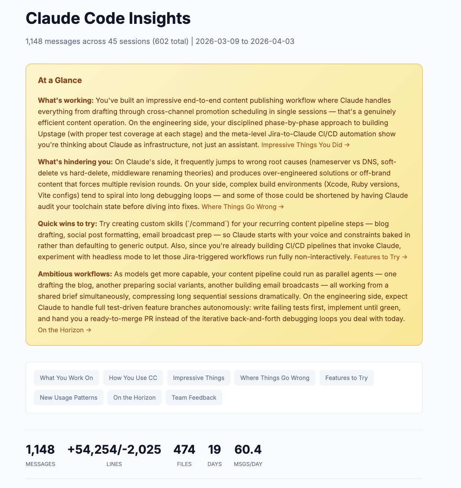

I've been using Claude Code daily for months, and I thought I had a pretty good handle on my own workflow. Turns out there were patterns I couldn't see from inside them. For example, when Claude told me I was "a prolific, high-velocity builder who uses Claude Code as a true development partner."

I hadn't told Claude that or defined my personality in that way, but it figured it out by reading my session history.

Then it got more specific: "You clearly prefer to let Claude run with complex tasks, but you're not afraid to course-correct firmly when Claude goes off track." It even cited the exact moments where I'd interrupted Claude mid-task because it was heading in the wrong direction.

All of this analysis came from the `/insights` command, which looks at your Claude Code usage history and pulls out patterns, suggests ways you can make Claude Code work better for you and highlights ways of working that you may not have even noticed.

## What `/insights` actually does

The `/insights` command reads your local session data (the conversations you've had with Claude Code over the past 30 days) and generates an HTML report analyzing how you work. It looks at up to 50 sessions, pulls out patterns, and organizes everything into sections covering what you work on, where things go wrong, and what you could do differently.

The important thing for anyone who's privacy-conscious is that nothing leaves your machine. The analysis runs entirely on your local session logs, meaning no data gets sent to Anthropic or anyone else.

Think of it like a fitness tracker for your AI usage. You don't *need* one to go for a run, but seeing your patterns over time changes how you train.

To run it, just type `/insights` in any Claude Code session. It takes a minute or two to process, then opens an HTML report in your browser.

## The numbers that set the stage

The first thing you see is a stats bar across the top. Mine showed:

- **1,148 messages** across **45 sessions**
- **474 files** touched
- **54,254 lines added**, 2,025 removed
- All of this in **19 active days**

That's about 60 messages per day. Seeing it laid out like that was a reality check. I knew I used Claude Code a lot, but *quantifying* it made the scope tangible.

Below the stats, there are charts breaking down what you asked Claude to do (feature implementation, debugging, content editing), which tools it used most, what languages showed up in your sessions, and even what *type* of sessions you tend to run. Most of mine were "Multi Task" sessions, which tracks. I tend to start a Claude Code session and keep going until I've knocked out several things.

## What you work on (and how it knows)

The report automatically groups your sessions into project areas and synthesizes what you were actually *doing* across sessions and names the projects for you.

Mine identified five areas:

- **WordPress Sync Plugin Development** (~10 sessions) where I was working on a new plugin
- **Content Creation & Publishing Pipeline** (~10 sessions) for this very blog
- **Business Strategy & Product Planning** (~6 sessions) for things like positioning docs and pricing
- **Jira-to-Claude CI/CD Automation** (~4 sessions) where I was building a system that triggers Claude Code from Jira tickets
- **Full-Stack App Development** (~8 sessions) covering a handful of different apps I was building or deploying

Each one comes with a paragraph-long description of what I actually did in those sessions. Reading through them felt like getting a monthly recap I never wrote.

## The personality profile

This was the part that made me sit up. Under "How You Use Claude Code," the report builds a narrative profile of your working style. Not what you *think* you do, but what the data shows.

Mine said my interaction style is best described as "iterative delegation with active quality control." That's accurate. I don't write detailed specs upfront. I set ambitious goals and refine through collaboration, steering Claude back when it drifts.

It also noted I'm "particularly attuned to tone and voice," citing times I rejected salesy email templates, rewrote overly verbose social drafts, and updated my skills to match my writing style. I knew I was picky about voice, but I didn't realize how consistently it showed up in my sessions.

The key pattern it identified: "You delegate ambitious, end-to-end projects and let Claude run autonomously, but intervene decisively when it takes wrong approaches or doesn't match your voice and standards."

That's a more precise description of my workflow than I could have written myself.

## Where things go wrong (the most useful section)

I'd say the friction analysis is where the real value lives. It's easy to remember the wins. It's harder to see the patterns in what's slowing you down.

The report grouped my friction into three categories:

**Wrong initial diagnosis.** Claude frequently jumped to incorrect root causes before investigating properly. In one session, it insisted individual DNS records were wrong when I'd actually updated nameservers. In another, it chased a Next.js middleware theory before bothering to check environment variables. Each wrong guess cost time while I redirected.

**Over-complicated or off-brand output.** Claude's first attempts at content consistently missed my voice. Email templates came out too salesy. Social posts were over-narrated. On the engineering side, it would suggest hosted components and complex bundles when I wanted something simple.

**Environment and build configuration struggles.** Xcode, Ruby versions, Vite configs. When build tooling got complicated, Claude would cycle through multiple failed fix attempts. One Xcode session never resolved at all.

The report backed each of these up with specific examples from my sessions. Not generic advice, but actual things that happened to me.

Seeing the numbers made it concrete: 45 instances of buggy code, 43 instances of wrong approaches. Those aren't catastrophic individually, but they add up to a lot of wasted back-and-forth over a month.

## Copy-paste rules for your CLAUDE.md

This is where `/insights` goes from interesting to immediately actionable.

Based on the friction patterns it found, the report generates ready-to-use rules you can paste directly into your [CLAUDE.md file](/blog/the-claude-md-masterclass/). Each one comes with an explanation of *why* it's suggesting it, tied to specific sessions where the problem occurred.

Mine suggested things like:

> When debugging, start with the simplest explanation first (environment variables, config files, DNS propagation) before jumping to complex theories. Ask clarifying questions rather than guessing.

And:

> When drafting social media posts, tweets, LinkedIn content, or email copy, use a concise, non-salesy tone. Avoid over-narrating or being verbose.

## Features it thinks you should try

The report also recommends Claude Code features based on your usage patterns. Not a generic feature list, but specific suggestions tied to how *you* work.

For me, it recommended:

- **Custom skills** for my recurring content pipeline (draft, edit, publish, schedule) so Claude starts with my voice and constraints baked in
- **Hooks** to auto-run linters after edits, since I had a lot of buggy-code friction that could've been caught earlier
- **Headless mode** for the Jira-to-GitHub automation I was already building, so those workflows could run without me babysitting them

Each recommendation comes with example code you can paste directly into Claude Code to set it up, which makes the barrier between "good idea" and "actually doing it" basically zero.

## What I changed after reading this

The report confirmed some things I already suspected and revealed a few I didn't.

I knew I was picky about voice. I didn't realize *how much* session time I was spending correcting tone. Adding those CLAUDE.md rules about concise, non-salesy output cut down on back-and-forth noticeably.

I knew Claude sometimes guessed wrong on debugging. I didn't realize it was happening 43 times in a month. The "start with the simplest explanation" rule has already helped. Claude now asks clarifying questions more often instead of diving into theories.

The biggest shift was more of a mindset thing. Seeing that 93% of my goals were fully or mostly achieved confirmed that I'm mostly getting the results I want out of Claude Code. The friction points are real, but they're the exception, not the rule. That's useful perspective when you're in the middle of a frustrating debugging loop.

## Make it a habit

The `/insights` command isn't just something you run once. Personally, I plan to check it every month or so, the same way you'd review your analytics or check in on campaign performance. Your patterns change as you get better at using Claude Code, and the report changes with them.

If you've been using Claude Code for even a few weeks, you have enough session data for a meaningful report. Type `/insights`, let it process, and see what it finds. The patterns it surfaces might surprise you.

And if you find something interesting in your report, I'd love to hear about it. Reach out on [Twitter](https://twitter.com/kkoppenhaver), [LinkedIn](https://linkedin.com/in/keanankoppenhaver), or send me an email at keanan@claudecodeformarketers.com.
