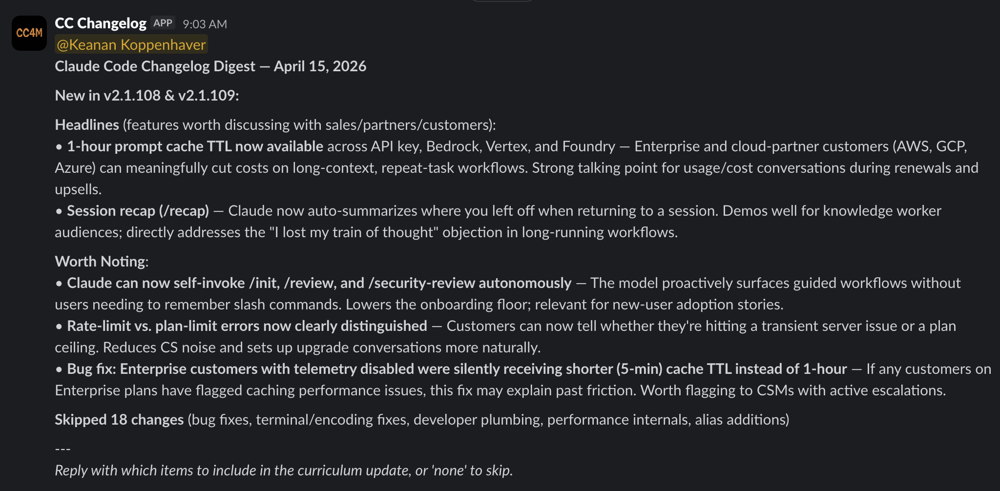

A few weeks ago, a prospect asked me if we had feature parity with a competitor on something I didn't even know the competitor had shipped. They'd launched it *five days earlier*. It was right there on their changelog, in plain English, and I'd completely missed it.

That's a bad feeling, because I should have known about it. I should have had a response ready. Instead, I was scrambling to pull up their release notes on a live call.

The thing is, I *know* I should be monitoring competitor changelogs. (I've written before about using Claude Code for [deep competitor research](/blog/deep-research-competitor-analysis/), and the daily monitoring piece was the missing companion to that.) But have you actually tried doing that consistently? Most product teams ship updates weekly (some daily), and reading through a wall of version numbers and patch notes to figure out what actually matters for your positioning is mind-numbing work. Nobody is going to do that every morning before their first coffee.

So I stopped trying to do it myself and built a Claude Code automation that does it for me.

## The setup: Claude Code runs in the cloud now

If you've been using Claude Code for a while, you're used to it running on your machine. You open a terminal, start a session, and Claude works alongside you. But there's a newer capability that changes what's possible: **scheduled remote triggers**.

The short version is that you can tell Claude Code to run a task on a schedule, completely in the cloud, on Anthropic's infrastructure. Your laptop doesn't need to be open. You don't need to be at your desk. It just runs.

I used this to set up a daily automation that checks a competitor's public changelog every morning at 9 AM, filters for the updates that actually matter to my positioning, and sends me a Slack message with a summary.

**One thing to note:** scheduled remote triggers require a paid Claude plan. If you're on the free tier, this particular automation won't be available to you yet.

## Building it with `/schedule`

The setup itself is surprisingly conversational. You open Claude Code, use the `/schedule` command, and describe what you want in plain English. Something like:

> Every morning at 9 AM Central, check [competitor's changelog URL] for new updates. Filter for changes that affect our competitive positioning and send a summary to my Slack channel via webhook.

Claude takes it from there. It sets up the scheduled trigger, configures the timing, and figures out how to fetch the changelog and deliver the results.

I won't pretend it worked perfectly on the first try. The initial run hit a network access issue (the cloud environment has more restricted access by default than your local machine), and I had to work through a couple of tool availability hiccups. But Claude surfaced each error clearly, and after two or three iterations the whole thing was running. This kind of back-and-forth debugging is pretty normal with Claude Code, especially when you're setting up something that involves external services.

The key things Claude needs from you:

1. **The URL to monitor.** Your competitor's changelog page, release notes, or GitHub releases page. Anything publicly accessible.
2. **The schedule.** How often you want it to check. Daily is a good default.
3. **Where to send results.** A Slack incoming webhook URL, an email address or something else. No matter which option you choose, Claude can walk you through the process.

## Teaching Claude what you actually care about

Without a filter, this automation would just dump every changelog entry into your Slack. That's barely better than reading the changelog yourself. The real value is in teaching Claude what matters to *you* specifically, so it only surfaces the updates that deserve your attention.

This calibration happens as a conversation. You review some real changelog entries with Claude and tell it what to flag and what to skip. It's less like writing rules and more like training a new team member on what to watch for.

In practice, it looked something like this. Claude pulled a batch of recent changelog entries and presented them to me one by one, asking whether each one was worth surfacing. A real exchange went roughly like:

> **Claude:** "They added support for Bedrock Mantle integration. Should I surface this?"
>
> **Me:** "Yes. That unlocks a whole new customer segment for them. I want to know about any new platform integrations."

Then a few entries later:

> **Claude:** "Performance improvement: reduced dashboard load time by 40%."
>
> **Me:** "Skip. Unless they're fixing something that's a known pain point we compete on, I don't need to hear about speed bumps."

And another:

> **Claude:** "New PowerShell support for their CLI tool."
>
> **Me:** "Surface that one. New platform support means they're reaching users we might be missing."

After maybe 15 minutes of this back-and-forth, Claude had a solid feel for my priorities. It synthesized everything into a filtering heuristic and asked me to confirm before locking it in. The whole process felt like onboarding a new colleague, just faster.

Here's the framework I ended up with:

### What to surface

**Features that overlap with your product.** If a competitor ships something that's already in your feature set, your sales team is going to get asked about it. "Do you have this too?" is coming, and you want to be ready.

**Features moving into your territory.** If they're building in an area you've owned, that's a positioning shift you need to respond to. Maybe it means updating your comparison page, maybe it means accelerating your own roadmap conversations. Either way, you need to know.

**Spaces they're abandoning.** Just as valuable. If a competitor deprecates a feature or stops investing in an area, that's an opportunity to claim that space more aggressively in your messaging.

**Pricing or packaging changes.** Always worth knowing about. If they move something from a premium tier to their free plan (or vice versa), that changes the competitive conversation.

**Anything prospects will ask about.** This is the catch-all. If a customer or prospect is likely to bring it up, you want to have already seen it.

### What to skip

**Bug fixes and minor patches.** Unless they're fixing a notorious pain point that you compete on, these aren't worth your time.

**Performance optimizations.** Same logic. "We made the dashboard 200ms faster" doesn't change your positioning.

**Developer-facing changes.** API updates, SDK releases, infrastructure refactors. Unless your product specifically competes on developer experience, this is noise.

**Anything that requires deep technical context.** If you need an engineering degree to understand why it matters, it's probably not affecting your marketing conversations.

The beauty of doing this calibration conversationally is that you don't need to be precise upfront. You tell Claude your general priorities, it starts filtering, and you course-correct from there. "Actually, I don't need to know about their mobile app updates, we don't compete on mobile" and Claude adjusts.

## What the digest actually looks like

Every morning at 9 AM, a Slack message shows up in my channel. It's not a raw changelog dump. Each item gets a one-line "so what" that explains why it matters for my positioning.

On days when there's nothing worth flagging, I get a short "no significant updates" message instead. That's almost as valuable, because silence means I can stop wondering whether I missed something.

## It's still too noisy (and that's fine)

I'll be honest: even after calibrating, my digest is still noisier than I'd like. Part of that is that I picked Claude Code, which ships a ton of updates almost daily. When a product moves that fast, even a well-tuned filter lets through more than you'd ideally want.

But this isn't a set-it-and-forget-it situation, and that's actually the nice part. Adjusting the filter is just another conversation with Claude. After a week of digests, I went back and said "stop surfacing minor integration additions unless they're for platforms our customers actually use" and the next morning's digest was tighter.

I'd recommend giving it a full week before you start tuning. You need to see a few digests land in your Slack before you'll have a feel for what's noise and what's signal.

And once you've dialed in one competitor, you can set up a separate automation for each additional competitor you want to track. I started with one to get the calibration right before expanding.

## Go build yours

Pick one competitor. The one whose updates you should be tracking but aren't. Open Claude Code, use `/schedule`, and describe what you want. Twenty minutes from now, you'll have a system that makes sure you never get caught off guard on a sales call again. (If you want to see another "boring task on a schedule" example, here's how I [automate Kit broadcasts with a skill](/blog/automate-kit-broadcasts-with-skills/).)

If you set one up, I'd love to hear how it goes. Find me on [Twitter](https://twitter.com/kkoppenhaver) or [LinkedIn](https://linkedin.com/in/keanankoppenhaver) and tell me what you're monitoring.
