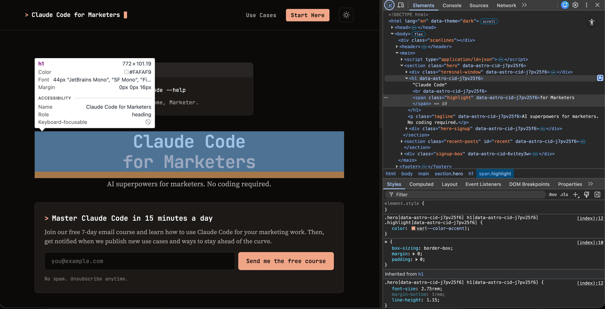
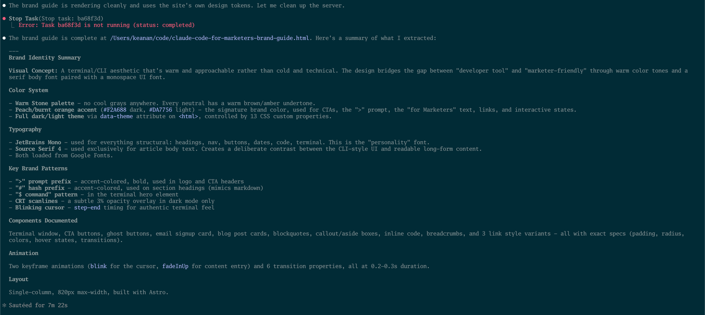

Most website brands don't get created all at once, the accumulate over time. You pick a heading font one week, a button color the next, tweak the link hover state three months later, and it just keeps building from there.

Each decision makes sense in the moment, but nobody's writing it down. After a year or two, your site has a real visual identity baked into it, but the only record of those choices lives scattered across CSS files, old Slack messages, and the vague memory of "I think we went with the warmer orange."

Sitting down to reverse-engineer all of that into a formal document feels like exactly the kind of tedious project that never makes it to the top of the list. But when I wanted to do something similar for my own site, I decided to take a chance.

What if I pointed Claude Code at the site and asked it to build the brand guide for me?

## What the DevTools MCP is

If you've read my post on [giving Claude Code superpowers with MCP servers](/blog/giving-claude-code-superpowers-with-mcp-servers/), you already know that MCP servers let Claude Code interact with external tools. The [DevTools MCP](https://github.com/ChromeDevTools/chrome-devtools-mcp) is one of the most useful ones I've found. It connects Claude Code to a Chrome browser session, giving it the ability to inspect elements, read computed styles, take snapshots of the page, and generally do everything you'd do manually in Chrome DevTools.

With this MCP enabled, Claude can process an entire page's worth of CSS variables, font stacks, and component patterns in seconds, without you having to squint at Chrome Dev Tools yourself.

## Setting up

First, you'll need to install the DevTools MCP server. In your terminal, run:

```
claude mcp add chrome-devtools -- npx @anthropic-ai/chrome-devtools-mcp@latest
```

Then, Claude Code will have the ability to open its own version of Chrome and navigate to the site you want to inspect.

For this walkthrough, I asked for a brand guide for <a href="claudecodeformarketers.com">claudecodeformarketers.com</a> (the site you're on right now!), but this works with any website, including your own, a competitor's, or a client's site you need to document.

## Pointing Claude at the site

With the DevTools MCP connected, I started a new Claude Code session and gave it a straightforward prompt:

> Open claudecodeformarketers.com and inspect the page and extract every brand element you can find: colors, fonts, spacing, components, animations, anything that defines the visual identity. Give me a summary of what you find. Please develop a comprehensive HTML brand guide.

Claude immediately got to work. It took a snapshot of the page, inspected the DOM (the elements on the webpage), and started pulling out CSS custom properties, computed styles, font declarations, and component patterns.



## What Claude found

Within a few seconds, Claude had identified:

- **9 color tokens** for light mode and 9 for dark mode, all defined as CSS custom properties
- **2 font families** (JetBrains Mono for UI elements, Source Serif 4 for body text) with their full weight ranges
- **Component patterns** including buttons, tags, cards, email inputs, inline code styling, and link treatments
- **Special effects** like the blinking cursor animation, the CRT scanline overlay in dark mode, and the terminal window motif
- **Layout specs** including the 820px max width, padding values, and sticky header behavior

This is the kind of thing that would take me an hour or more to document manually. Claude had it organized and categorized in seconds.



## The result

The finished brand guide is live at [/brand-guide.html](/brand-guide.html) (take a look for yourself!). It's a single self-contained HTML file that covers:

- **Brand identity** including mission, audience, and design concept
- **Full color palette** for both light and dark modes with click-to-copy hex values
- **Typography specimens** showing every level of the type scale with live rendering
- **Component showcase** with buttons, tags, cards, email inputs, inline code, and link styles
- **Special effects** including the terminal window, blinking cursor, and scanline overlay
- **Layout specs** covering max width, padding, border radii, and transition timing

The whole thing took less than 10 minutes from start to finish, and I didn't open Figma, Sketch, or any design tool at any point.

If you wanted to use this with 
a different AI assistant, you could always ask for this information to be presented as Markdown as well. I just felt HTML here made a bit more of a display of the styles it found.

## Why this matters for marketers

This workflow isn't just about documenting your own brand (though that's useful enough on its own). Here are a few other ways I've been thinking about using it:

**Competitor analysis.** Point Claude at a competitor's website and extract their entire visual system. You'll see exactly what colors they use, how they handle typography, what components they rely on. It's a level of competitive intelligence that would take hours to compile manually.

**Agency briefs.** If you work with freelancers or agencies, generating a brand guide for your client gives you everything you need to stay on-brand without back-and-forth about "which shade of orange" you meant.

**Client onboarding.** If you're a consultant or agency yourself, you can inspect a new client's existing site and have a documented brand system before the first meeting.

**Redesign planning.** Before you redesign anything, it helps to know exactly what you're working with. A generated brand guide makes the current state concrete and shareable.

## Try it on your own site

The whole process is: install the DevTools MCP, open your site in Chrome, and ask Claude to inspect and document it. You don't need any design expertise or CSS knowledge. Claude handles the extraction, organization, and presentation.

If you try this on your own site (or a competitor's), I'd love to see the result. Send me a copy on [Twitter](https://twitter.com/kkoppenhaver) or [LinkedIn](https://linkedin.com/in/keanankoppenhaver). I'm looking forward to seeing what you create.
