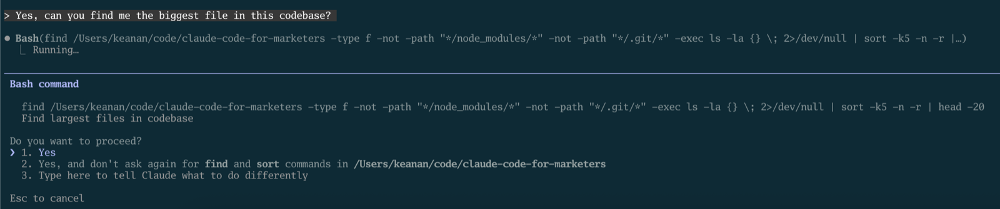

When people hear about Claude Code and get excited, I can almost see that excitement fade in real time when they see that it lives inside the terminal.

I get it. The terminal looks intimidating. A black screen with a cursor, waiting for you to type something in a syntax you probably don't know. It feels like one wrong move could wreck your entire computer.

But here's the thing: the terminal is just a textbox*.

<em>* Ok, that's a bit reductive. It's a textbox that can control your entire computer, so "just" is doing a lot of heavy lifting there. But that's what makes it powerful. It's the most direct way to talk to your machine. You type what you want, and it happens.</em>

## How commands work

Everything in the terminal runs on commands. These are short text instructions (usually abbreviations) that tell your machine what you want to accomplish. Here are a few examples:

- `ls` lists the files in your current folder
- `mkdir` creates a new folder
- `rm` removes a file

That last one is a bit scary. When you delete something with `rm`, there's no recycling bin. No "are you sure?" popup. It's just...gone.

But that directness is a double-edged sword. It's what makes the terminal so efficient, but it's also why people are nervous about it.

## This is where Claude Code comes in

Claude Code runs in the terminal. Because the terminal can do anything on your computer, Claude Code can too—that's what makes it so powerful. It can actually *do things* on your machine. Create files. Run code. Make real changes to your projects. Anything you can do on your computer, Claude Code can do when you give it access.

You might be nervous about giving an AI that kind of access, which I'd say is a pretty reasonable response.

But here's the thing that changes everything: you don't have to learn any of this before you get started. You describe what you want in plain English, and Claude figures out the commands. You can learn how the terminal works along the way, if you want to—but you don't need to know anything to begin.

It's going to be ok. Here's why.

## Three reasons not to panic

### 1. Claude asks about everything

Nothing happens without your approval. When Claude wants to run a command or make a change, it asks first. You see exactly what it's proposing, and you can say yes or no.

You're always in the driver's seat. If something feels risky, just say no and tell Claude what you want to try instead.

### 2. You can verify any command

You don't have to take anything on faith. If Claude suggests running something and you're not sure what it does, you have options:

- Ask Claude directly: "Why do you want to run this? What will happen?"
- Paste the command into ChatGPT (or another tool) and ask "what does this do?"
- Google it and read the documentation

I don't have every terminal command memorized either. Looking things up isn't a sign you're doing it wrong, it's just how everyone works.

### 3. Guardrails exist

Claude Code has built-in ways to add extra safety rails—there's a feature called "hooks" that lets you block certain dangerous commands entirely, which we'll cover in a future post.

And then there's version control. Think of it like "track changes" in Microsoft Word, but for your entire project. Every change gets recorded. Made a mistake? You can see exactly what changed and restore any previous version. It's like having an unlimited undo button for everything Claude does.

## The terminal isn't as scary as it looks

Yes, it's different from the apps you're used to. Yes, there's a learning curve. But you don't need to become a command-line expert to use Claude Code effectively. You just need to be willing to try.

Ready to get going? In [our next post](/blog/installing-claude-code/), we'll actually jump into the terminal and install Claude Code to get just a taste of what it can do.

And if you have any questions I can answer, shoot me an email at <a href="mailto:keanan@claudecodeformarketers.com">keanan@claudecodeformarketers.com</a>. I read and respond to every message and I'm here to help.
