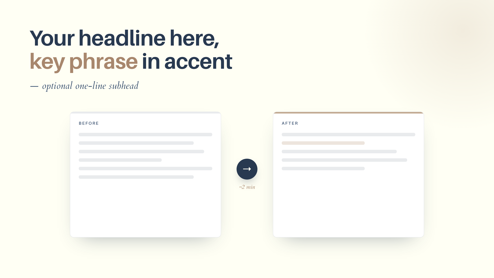
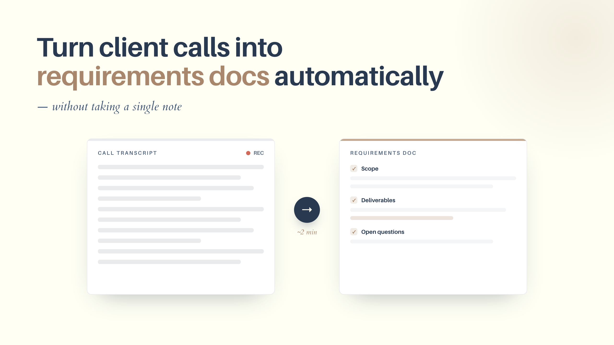

**Short on time? Here's the whole idea:** featured images are a small tax you pay on every single post, and AI image generators aren't a perfect solve, because they're often not great with text or your exact brand. The fix is to author the image as an HTML card that uses your real brand colors and fonts, then render it to a PNG. You do the brand setup once, and after that every post is copy the template, swap the headline and one visual, and render. Below is the exact setup, a working example example, and how I turned it into a skill any instance of Claude can re-use.

---

Every post needs a featured image for when it's shared in Slack, on social media or anywhere else. But this means that for every post, you're fiddling in Canva for twenty minutes, fighting to get your brand colors exactly right, or you give up and drop in a piece of stock art that looks like every other blog on the internet. None of it is hard. It's just friction, repeated forever, once per post.

So I went looking for a way to spend time doing this once and getting the benefit of a custom featured image forever after that.

The obvious first stop is an AI image generator, and that's the wrong tool for this specific job. I wrote a [whole post on why I stopped using AI image generators for infographics](/blog/why-i-stopped-using-ai-image-generators-for-infographics), and featured images have the same problem. Those tools are great for illustrative or photographic hero art, a mood, a scene, or a concept. But they're not so great at the things a featured image usually needs: a precise headline in your exact font, your exact hex codes, clean alignment, text that's actually spelled right. Ask a generator for "a card with this headline in my brand navy" and you get something close-ish, with slightly wrong colors and sometimes even mangled letters (although these image models are constantly getting better).

So I stopped asking a model to paint the card and started asking Claude to *write* it.

## Author the image as HTML, then render it to a PNG

The whole approach is two steps. First, build the featured image as a 1280×720 HTML "card," a single page with your headline, one supporting visual, and your brand colors and fonts baked in as CSS. Then render that page to a PNG.

This sounds like more work than Canva. It's less, and the reason is the second time. The first card takes a little setup. Every card after that is copy a template, change the headline, swap one visual, and render. You get pixel-perfect brand fidelity because you're using your literal hex codes and font files, and you get it in seconds because it's just code.

Claude builds the HTML and CSS based on your written post and you don't touch a layout tool. You describe the card or hand it the headline, it produces the markup, and you tweak the wording and pick the one visual that fits.

## The worked example: one post, one card, in a single pass

Here's a real one. I took a FloorboardAI post, "How to turn client calls into requirements docs," and turned it into a featured image in one pass. The headline with one accent phrase, plus a simple "messy transcript → clean requirements doc" before-and-after visual, all in Floorboard's actual navy-and-cream brand with its real fonts (Aileron for the headline, Cardo for the italic subhead).

The template starts generic, with placeholder headline and a sample before/after visual:



And the finished card, after swapping in the real headline and tuning the visual:



## The three moving parts

You only have to understand three small pieces, and Claude writes most of them.

### 1. The HTML card, with your brand as CSS variables

The card is a fixed-size element with your brand tokens defined once at the top, then used everywhere. Real fonts come in through `@font-face` (for your own font files) or a Google Fonts link. Here's the shape of it, trimmed down:

```css
:root {
  --cream: #fffff4;
  --navy: #283950;
  --accent: #c2a990;
}
@font-face {
  font-family: Aileron;
  src: url("fonts/Aileron-Bold.otf") format("opentype");
}
#card {
  width: 1280px;
  height: 720px;
  background: var(--cream);
  color: var(--navy);
  font-family: "Aileron", sans-serif;
}
```

That's the part that makes it on-brand instead of close-ish. The colors are your colors, down to the hex. The headline is set in your actual typeface. You put the accent color on the *one* key phrase in the headline and leave everything else in the primary text color. Before you start, have Claude Code generate or find these variables for you.

### 2. The render script

This is the part that turns the page into an image. It's a short Node script using Playwright (which drives headless Chromium). The one detail that matters: `deviceScaleFactor: 2`, which renders at 2× so the text is crisp on retina screens. It screenshots just the `#card` element, so you don't have to fuss with cropping.

```js
import { chromium } from "playwright";

const slug = process.argv[2]; // e.g. "my-post-featured"
const browser = await chromium.launch();
const context = await browser.newContext({ deviceScaleFactor: 2 }); // 2x = crisp
const page = await context.newPage();

await page.goto("file://" + `${process.cwd()}/${slug}.html`);
await page.waitForLoadState("networkidle");
await page.locator("#card").screenshot({ path: `${slug}.png` });

await browser.close();
```

Run it with `node export.mjs my-post-featured` and you get `my-post-featured.png` at 2560×1440, ready to upload.

### 3. Configure once, render forever

The setup that makes this repeatable is a tiny config file that records your brand once: dimensions, fonts, and tokens. After this exists, every new post copies the template and changes only the headline and visual.

```json
{
  "brand": "FloorboardAI",
  "dimensions": { "width": 1280, "height": 720 },
  "deviceScaleFactor": 2,
  "fonts": { "heading": "Aileron", "accent": "Cardo" },
  "tokens": { "bg": "#fffff4", "text": "#283950", "accent": "#c2a990" }
}
```

The compounding move is right here. You answer "what's my brand" exactly one time. Every post after that inherits it for free.

## Setting it up the first time

The one-time setup is quick, and Claude does the fiddly parts. The flow looks like this:

1. **Pick a folder for your images.** I keep an `infographics/` folder at the root of my blog repo. The template, the script, and the config all live there.
2. **Install the renderer.** One command adds Playwright and its headless Chromium to that folder. The browser binary is cached globally, so you only ever download it once even if you do this for several projects.
3. **Hand Claude your brand.** Give it your colors as hex codes, your fonts (font files or Google Fonts names), and your dimensions, and have it write the `brand-template.html` and the `featured-image.json` config. This is the step you do exactly once.
4. **Render a test card.** Run the script on the template to confirm the fonts load and the colors are right. Tweak, re-render, and you're done.

From that point on you never touch the setup again. Every post is just the next two minutes: copy the template, change the headline, swap the visual, render.

## Make it a skill: "make a featured image for this post"

Once the template, the render script, and the config exist, the whole thing collapses into a single instruction. I packaged it as a Claude Code skill called `featured-image`, and now the workflow is literally me saying *"make a featured image for this post."* The skill checks whether the project is configured, walks me through brand setup the first time if it isn't, then copies the template, fills in the headline and visual from the post, renders the PNG, and hands me the file.

It's [open source in my cc-skills repo](https://github.com/kkoppenhaver/cc-skills/tree/main/featured-image) if you want to install it or read how it works. If skills are new to you, I rounded up [the ones I think every marketer should install](/blog/claude-code-skills-for-marketers), and this is a good example of the real lesson there: the highest-value skill is usually the one you build for your own repeated chore.

## When to render from HTML and when to reach for a generator

The rule I use is simple: if the image is text plus exact brand, a headline card, a quote graphic, a stat callout, render it from HTML. If the image is illustrative or photographic, a hero scene, a mood, an abstract concept with no text, reach for an AI image model (like Nano Banana). This post and the infographics post are the two halves of "how to make blog visuals without a design tool," and knowing which half you're in saves you a lot of fighting with the wrong tool.

One more place this connects: the tokens in your config have to come from somewhere. If you've never written your brand down as hex codes and fonts, that's its own quick project, and I wrote up [how I built a brand guide without opening a design tool](/blog/create-a-brand-guide-with-devtools-mcp). Do that once and you'll have the exact values this workflow needs.

## The payoff

The first card costs you a little setup. Every card after that costs you a headline and a few seconds. After that, you'll stop dreading the featured-image step, your posts finally look like they came from the same place, and the brand is exact because you're rendering from your real colors and fonts instead of describing them to a model and hoping.

If you build the template for your own blog, I'd love to see it. And if you want the shortcut, the [featured-image skill](https://github.com/kkoppenhaver/cc-skills/tree/main/featured-image) is the version I actually use every week.
