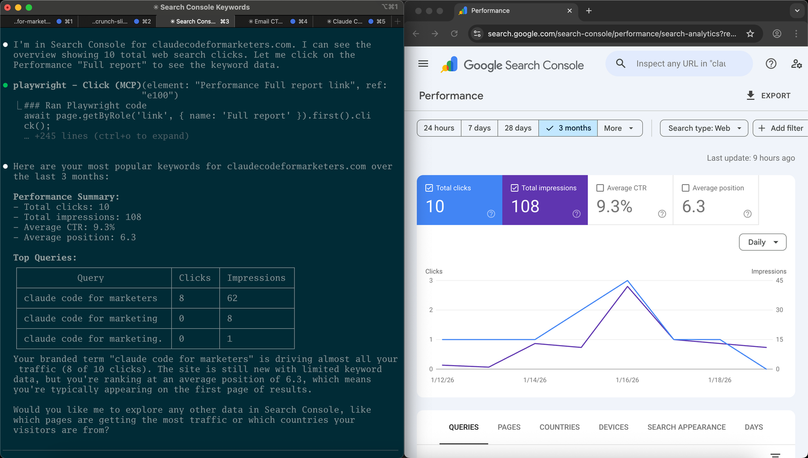

Claude Code is powerful, but out of the box it's somewhat trapped inside your computer. It can see your files, run commands, and help you build things, but it can't see your browser or interact with any tools that _aren't_ on your machine. It can't look at your project management tool. It can't query your analytics dashboard or add something to your content calendar in tools like Notion.

MCP servers change that. They give Claude Code hands to reach into your other tools and actually do things on your behalf. And the best part? You don't need to write any code to use them.

## So what exactly is an MCP server?

MCP stands for Model Context Protocol. That's a mouthful, so most people just call it MCP.

Here's the simple version: an MCP server is a little bridge that connects Claude Code to another tool (like your project management tool or a web browser). Someone else builds that bridge, packages it up, and you just install it. Then Claude can use that tool directly, in conversation with you.

Before MCP servers existed, if you wanted Claude to interact with your Notion workspace (for example), you'd need to write code to make that connection happen. You'd need to understand APIs, authentication and data formats. It was definitely a developer's job.

Now? You add a few lines to a configuration file, and suddenly Claude can read your Notion pages, add items to your databases, or pull context from your docs. The hard work has already been done by whoever built the MCP.

**MCP servers give you the benefits of custom integrations without needing to be a developer.**

## How MCP servers are different from APIs

If you've used a tool like Zapier or Make, you're already familiar with APIs. APIs (application programming interfaces) are how different software tools talk to each other. When you connect your email tool to your CRM, there's an API making that happen behind the scenes.

The difference with MCP servers is who's doing the talking.

With a traditional API integration (or a Zapier workflow), you set up the connection and define exactly what happens: "When I get an email with this subject line, create a task in Asana." Your tool then calls specific endpoints to perform these actions and follows the rules set forth by the API.

With MCP servers, Claude is the one using the connection. You ask Claude to do something, it checks what tools are available, and figures out how to accomplish your request. It's thinking through the problem and taking action instead of following a preset recipe.

A Zapier workflow for analytics reporting might be: "Every Monday, pull last week's traffic numbers and post them to Slack." That runs the same way every time, whether traffic was flat or you had a viral post.

With an MCP server, you'd say: "Hey Claude, look at my analytics and tell me if anything interesting happened this week. If there's a big change, write up a summary and add it to my weekly report in Notion." Claude looks at the data, decides what's actually noteworthy, writes the summary, and puts it where you asked.

**MCP servers let Claude take action on your behalf, using judgment and all the available tools, instead of you having to choose API endpoints and make rigid connections ahead of time.**

## Security and trust

At this point you might be thinking: "Wait, I'm just going to _give_ Claude access to my tools? What can it actually do?"

That's a fair concern. Here's how it works.

MCP servers only do what you configure them to do. When you install a Notion MCP server, Claude gets access to Notion. It doesn't get access to your email, your browser, or anything else. Each MCP server is a specific, scoped connection.

And just like with everything else in Claude Code, Claude asks before taking action. If Claude wants to create a new page in Notion or update a database, you'll see exactly what it's proposing before it happens. You're still in the driver's seat.

That said, you're still at the mercy of whoever built the MCP server. If they've built something malicious into their implementation, it could have serious consequences when you hook it up to your particular account.

With that in mind, there are a few ways you can stay safe:

- **Stick to official MCP servers when possible.** Many tool vendors now maintain their own MCP servers. These are generally more trustworthy than random community projects.
- **Start with read-only access.** Some MCP servers let you configure whether Claude can just read data or also write/modify. If you're nervous, start read-only and expand from there.
- **You can always uninstall.** If an MCP isn't working out or you're uncomfortable, removing it is as simple as deleting a few lines from your config.

The permission model is the same one that makes Claude Code safe to use in general: nothing happens without your approval.

With the definitional groundwork laid, let's take a look at a couple examples of how you might use MCP servers with Claude Code.

## One example: automating a web browser with Playwright

Let's look at a real MCP in action. [Playwright](https://playwright.dev/) is a browser automation tool, and its MCP server lets Claude Code see and control a web browser.

This is useful for things like:

- Automatically taking screenshots of web pages
- Grabbing data from dashboards you're logged into but you can't access in any other automated way
- Having Claude test how a page looks or works
- Filling out forms automatically via a prompt

Installing the Playwright MCP takes one command:

```bash
claude mcp add playwright npx '@playwright/mcp@latest'
```

Run this in your terminal before starting Claude Code, and that's it! When you restart Claude Code, it will have access to its own browser.

### How to actually use it

Once Playwright is installed, you can ask Claude to do things like:

> "Use the Playwright MCP to find the most popular keywords for my site, claudecodeformarketers.com, in Google Search Console."

Claude knows to use the browser tool for this. A Chrome window will pop up, and you'll see Claude navigating around.



Here's where it gets clever: if the page requires you to log in, Claude can't type your password (and you wouldn't want it to). But it can open the browser, wait for you to log in manually, and then take over once you're authenticated.

**Pro tip:** Add a line to your project's CLAUDE.md file like: "If you get stuck with auth when using playwright, pause and ask the user to log in manually." This teaches Claude to hand control back to you when it hits a login wall, then resume once you're past it. It's a small thing, but it makes the whole flow much smoother.

## Another example: connecting Claude Code to your Notion workspace

Notion is where a lot of marketing teams keep everything: content calendars, campaign briefs, meeting notes, SOPs, and more. The Notion MCP server lets Claude read from and write to your workspace.

This means you can do things like:

- Ask Claude to summarize a long planning doc
- Add a new blog post idea to your content calendar directly from Claude Code
- Pull context from existing briefs when working on something new
- Create new Notion pages from templates you've already set up

### Setting it up

Notion offers a hosted MCP server that makes setup straightforward. Add it to Claude Code with:

```bash
claude mcp add --transport http notion https://mcp.notion.com/mcp
```

Then, inside Claude Code, run `/mcp` to see your connected servers. Select the Notion server and complete the login flow in your browser, and that's it: Claude now has access to your Notion workspace.

This means you don't have to manage any API tokens, or connect pages individually. The OAuth flow handles permissions the same way you'd connect any other app to Notion.

### How to actually use it

Once connected, you can have conversations like:

> "Look at my Content Calendar database in Notion and tell me what blog posts are scheduled for this month."

Or:

> "I just finished a call with a potential partner. Add a new page to my Meeting Notes database with today's date and these bullet points..."

Claude reads the structure of your Notion workspace and figures out how to interact with it. This means that instead of having to know specific API endpoints, database IDs or page structures, you can just describe what you want in plain English.

## What about your favorite tools?

Playwright and Notion are just two examples. The MCP ecosystem is growing fast, and many popular tools now have MCP servers available (either official ones from the vendor or community-built alternatives).

If you're curious whether your favorite tool has an MCP server, a quick search for "[tool name] MCP server" will usually tell you. Slack, Google Sheets, Airtable, Linear, GitHub, Figma, and plenty of others have MCP servers that work with Claude Code.

I wouldn't recommend going out and installing them all right away. Start with one that connects to a tool you use every day, get comfortable with how it works, and expand from there!

## MCP servers give Claude Code superpowers

Without MCP servers, Claude Code is a powerful assistant that lives in your terminal. It can help you write, build, and think, but it's cut off from the rest of your digital life.

With MCP servers, Claude becomes something closer to a coworker who can actually interact with your tools. It can check your project management system, look at your analytics, update your docs, and take real action on your behalf.

And here's the thing that matters most for non-technical folks: you don't need a deep technical understanding of the internals. You can install an MCP with a command or two, and suddenly Claude has a new capability. The complexity is hidden and the power is yours.

If you've been using Claude Code for a while and haven't tried MCP servers yet, start with Playwright. It's one command, and it immediately takes the blindfold off: Claude can finally see the web, take screenshots, and interact with pages you're logged into. It'll change how you think about what's possible.
