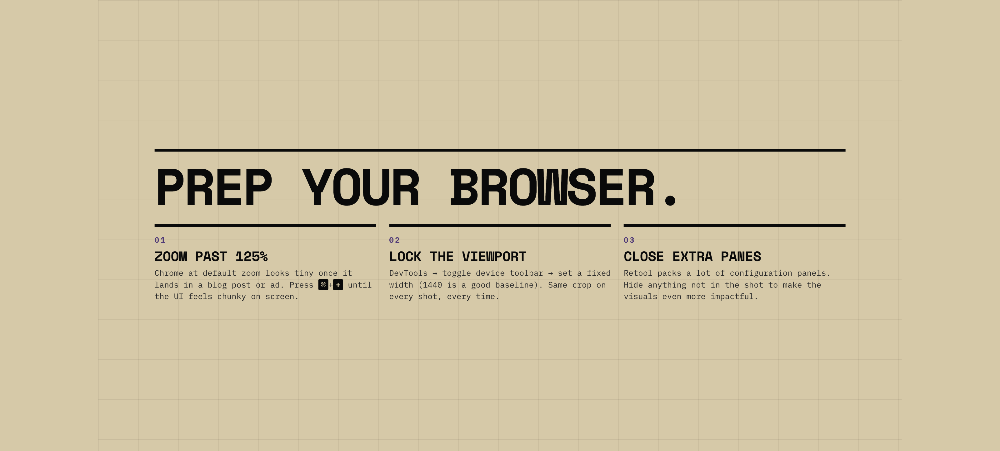
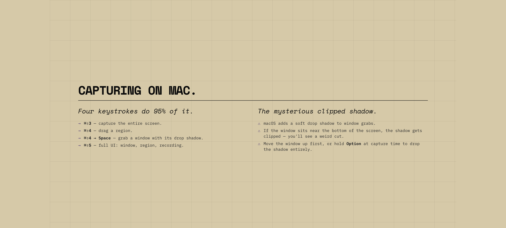
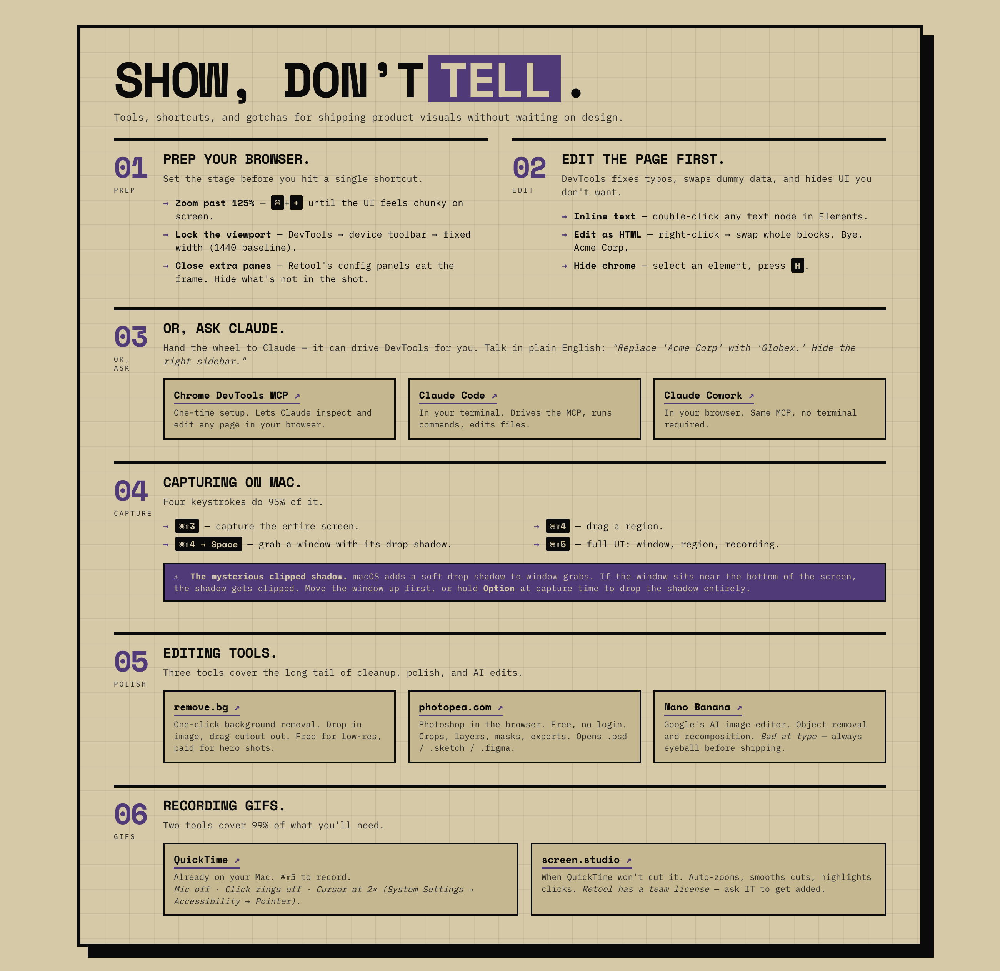

If you've been watching the Claude Code team on Twitter, you might've seen Thariq's post on [the unreasonable effectiveness of HTML](https://x.com/trq212/status/2052809885763747935). His argument, roughly is that the ideal output format for AI agents has quietly shifted in many cases from Markdown to HTML, because HTML can do more (tables, color, illustrations, layouts) and people are way more likely to actually read it.

I've watched the same shift happen in my own work, specifically when it comes to slide decks. I haven't opened Keynote or Google Slides because I realized that there was a better way. And it starts with HTML.

A couple weeks ago I had to give a 30-minute internal talk to the marketing team at Retool about how to capture better product visuals for our marketing materials. This is the kind of thing I would've spent a whole day building in Keynote, but I built the deck in HTML with Claude Code in about an hour, walked out with design praise from the team, and (the unexpected hit) a one-page printable takeaway that people frequently reference.

Here's how it went.

## The brief

My job was to take a 30-minute time slot and help the folks on our PMM team uplevel to be able to take baseline-good screenshots and GIFs of the product without having to ask a designer or DevRel every time.

I didn't have a designer available to help me make it look polished and I was under a bit of time pressure. I wanted something polished, but also practical and impactful and when I start by staring at the blank page in Keynote or Google Slides, I can never quite get there.

## Move 1: Generate ten themes, pick one

The first move was the one I'd been most worried about going in. "Make it look good" is the hardest thing to delegate to AI, because the default output of every LLM tends toward the same beige, Inter-on-white, faintly-purple-gradient aesthetic.

The unlock here is using the [frontend-design skill](https://github.com/anthropics/skills/tree/main/skills/frontend-design) for Claude Code, which pushed the model away from default aesthetics and toward something with a clear point of view.

I opened Claude Code and said:

> Let's use the /frontend-design tool, build the title slide and a couple slide templates in HTML, complete with a theme switcher, so I can figure out the best style/theme for the presentation. Please propose 5-10 themes based on the content and topic.

A few minutes later I had a working HTML file with a theme switcher in the corner. I clicked through the themes (Editorial magazine, Brutalist, Retro-futuristic, Soft pastel, Industrial, Art deco...) and I could see all ten directions for the deck side-by-side before committing to one.

One of the topic slides, using the brutalist treatment Claude generated.

Once I picked a direction (brutalist, with chunky typography and a heavy black border), I added one more request:

> Can you look at Retool's website and offer that type of treatment (brand style) as an option?

Claude fetched retool.com, pulled out the color palette and the typography system, and added a Retool-brand variant to the switcher. I split the difference: brutalist structure, but with `#503a77` (Retool's purple) as the accent color. Locked it in, threw away the rest, told Claude to delete the theme switcher.

The whole design-direction step took maybe 15 minutes instead of spending way longer than that hunting for a Keynote template that I liked and maybe not even finding anything.

## Move 2: Outline by interrogation

Once the visual direction was locked, I gave Claude the rough version of what I wanted to cover. It was a bulleted list like I'd sketch into a notebook when building a conference talk:

> Product visuals
> - Aspect ratio (devtools can help if you want)
> - Mysterious mac screenshot shadow when close to bottom of screen
> - You can make edits to the page using devtools
> - Remove.bg
> - Photopea for image editing
> - Zoom more than you think you need to (at least 125% in Chrome)
>
> GIFs
> - Likely just use Quicktime to record
> - screen.studio if you need more editing/zooming
>
> Video
> ??

Then the prompt that did most of the work:

> Here's my general outline for the deck. Please ask me questions one at a time and let's flesh this out into a proper outline, then we'll work it into slide formats and finally slides.

Claude started asking questions: Who's the audience exactly? How long do you have? Is this live or async? What's the one thing you want them to walk away knowing? Should we drop the Video section since it's underdeveloped? Where should "ask Claude to edit the page" sit relative to the actual capture step?

I answered one question at a time and by the end of that back-and-forth, I had a tight 14-slide structure split into two clear sections (Screenshots and GIFs), with a section divider between them and a Questions slide at the end. The slides were clearly based on my outline and shaped by my point of view instead of being generic.

A content slide on Mac screenshot shortcuts, generated from the outline back-and-forth.

This is the move that's most transferable beyond decks. Any time I'm building something structured (a blog post outline, a workflow doc, a webinar agenda) I now start with ["ask me questions one at a time until you have what you need."](/blog/getting-better-output-without-prompt-engineering/)

## Move 3: The same-style PDF takeaway

This was the part I didn't plan for, and the part that ended up being the most useful.

Most internal talks die after everyone closes Zoom. Three days later, nobody can find the deck, and the specific tools you mentioned have been forgotten, which is exactly what I wanted to prevent.

I asked Claude:

> In the same visual style, can we create a 1-pager version of this deck that includes links to all the mentioned tools and can serve as a takeaway?

Claude built it as a separate HTML file: same brutalist treatment, same purple accent, but reformatted as a single dense page with every tool I'd mentioned linked out. Then:

> Can we make it so the links are actually clickable in a PDF?

Two prompts and a Cmd+P later I had a print-quality, branded one-pager with working hyperlinks baked into the exported PDF. (If you want the deeper version of the print-export trick, I wrote about it as it applies to [infographics here](/blog/why-i-stopped-using-ai-image-generators-for-infographics))

The one-page takeaway, exported as a PDF with clickable hyperlinks.

I dropped it in the channel after the talk and folks loved it!

In the end, the slides were well-received, I got a few good questions and I know the cheatsheet is something people are going to be able to reference going forward, for the product launch we're currently working on and beyond.

## What this isn't good for

HTML isn't the right format for _everything_. HTML in general is less information-dense than a Google Doc or a long Markdown file, so if your real goal is async reading (a strategy doc, a brief, a teardown), write a doc instead. Reaching for HTML works when you need something more visual or a type of layout that Markdown or a text doc can't accomplish.

Real-time collaborative editing is harder in HTML vs a text doc (or even Google Slides). If three people on your team need to live-edit the deck the morning of, and only one of them runs Claude Code, you'll feel that friction.

When the deck IS the artifact (an internal talk, an external presentation you control, anything where you want the visuals to land and the leave-behind to look intentional) HTML is a great way to go.

## Where this goes next

The deeper pattern here is generating HTML output for your marketing artifacts. Once you start looking, it shows up everywhere:

- **Sales one-pagers and battle cards.** Same playbook as the takeaway above. Brutally simple, brand-true, print-ready.
- **Landing page mockups.** Skip Figma when you want to test a hero section. Have Claude build the page, iterate in the browser, ship to a real domain if it works.
- **Gated PDFs and lead magnets.** Cheatsheets, reference guides, workshop handouts. (I wrote about this for [infographics here](/blog/why-i-stopped-using-ai-image-generators-for-infographics), same idea on a different surface.)
- **Internal reports and dashboards.** Weekly status updates that nobody reads in a Google Doc actually get read when they're an HTML page with diagrams and color.

Next time you're about to open a tool to design something, pause and ask whether Claude Code could just generate it as HTML. Sometimes the answer is no. But it's "yes" way more often than I expected when I started looking.

Try it on your next talk. Open Claude Code, start with "use the /frontend-design skill and propose 5-10 themes for a presentation about [topic]." and see what comes back.

If you do try it, I'd love to hear how it goes. Find me on [Twitter](https://twitter.com/kkoppenhaver), [LinkedIn](https://linkedin.com/in/keanankoppenhaver), or just [email me](mailto:keanan@claudecodeformarketers.com).
