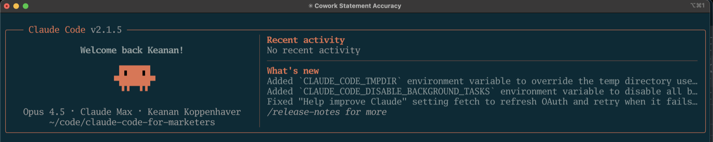
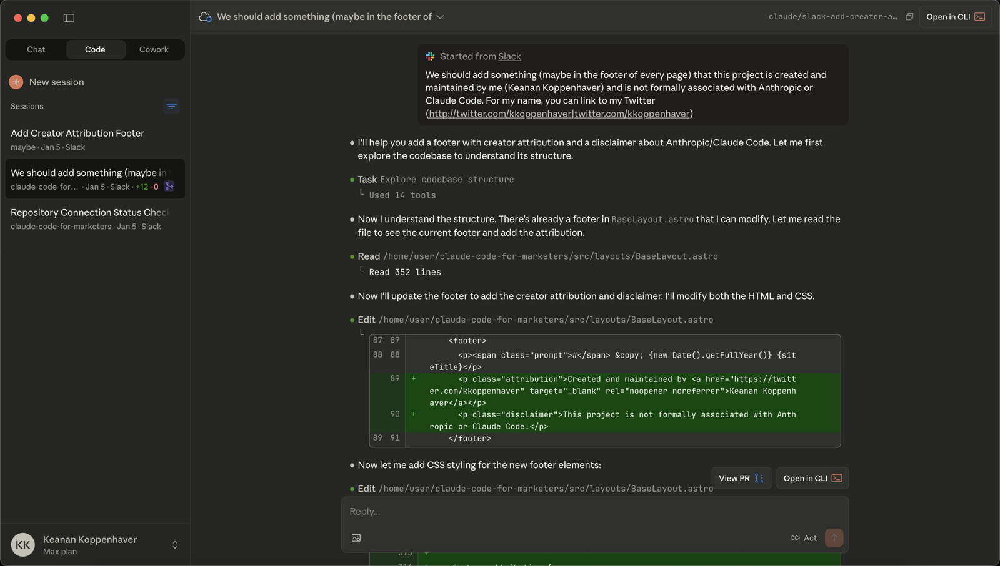
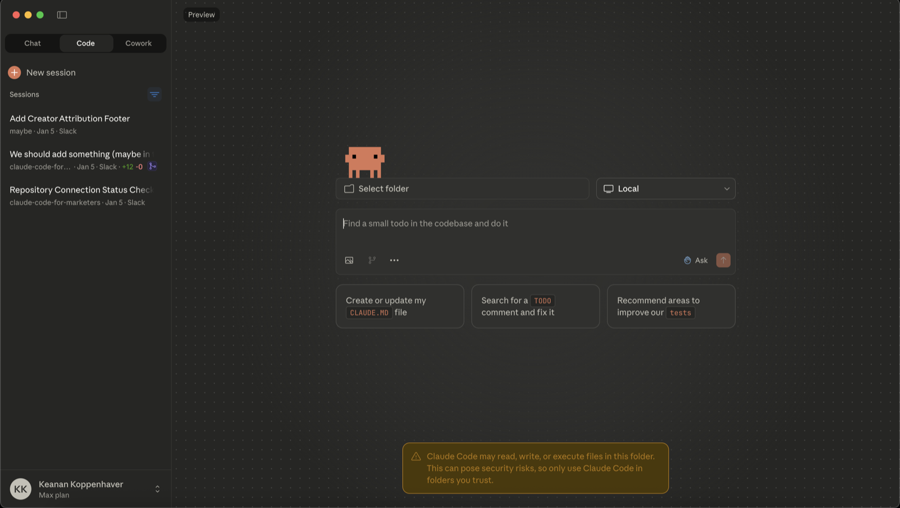

So, you've heard about Claude Code, read our post about [why the terminal isn't as scary as it looks](/blog/dont-be-scared-of-the-terminal/) and now you're ready to try it yourself.

But how do you actually get it running?

In this guide, we'll show you two different ways: one for people willing to use the terminal (which unlocks Claude Code's full power) and one using the Claude Desktop app (simpler, but with some limitations).

## What you'll need

Before we start, you'll need:

- **A Claude Pro subscription** — Claude Code requires a paid account. If you don't have one yet, you can sign up at [claude.ai](https://claude.ai).
- **A Mac or Windows computer** — We'll cover both operating systems below.

## Which installation method is right for you?

There are two ways to get Claude Code running:

**Installing via the terminal** gives you the full power of Claude Code. You can automate entire workflows, work directly with files on your computer, and build sophisticated multi-step processes. This is what we recommend if you're willing to get comfortable with the terminal.



**Claude Desktop app** is a simpler starting point. It's a familiar chat interface, and you can enable Claude Code features within it. Great for one-off tasks and experimentation, though with some limitations compared to the terminal version.



My recommendation: if you followed along with [our intro to the terminal](/blog/dont-be-scared-of-the-terminal/) and you're feeling even a little bit brave, go with the terminal installation. It's not much harder, and you'll have access to everything Claude Code can do.

## Method 1: Terminal installation

This is the recommended approach — and it's easier than you might think.

<!-- [TKTK: Add toggle/tabs for Mac vs Windows once we figure out the component] -->

### Mac

#### Step 1: Open Terminal

The Terminal app comes pre-installed on every Mac. The easiest way to find it:

1. Press `Cmd + Space` to open Spotlight
2. Type "Terminal"
3. Hit Enter

You'll see a window with a blank line waiting for your input. That's it! You're in the terminal.


#### Step 2: Install Claude Code

Now for the main event. Copy and paste this command into your terminal:

```bash
curl -fsSL https://claude.ai/install.sh | bash
```

Hit Enter and wait for it to finish. You'll see some text scroll by as it downloads and installs — that's normal.

#### Step 3: Authenticate with Claude

With Claude Code installed, you need to connect it to your Claude account. Type:

```bash
claude
```

If you're not prompted to log in, type `/login`. Either way, you'll see a browser window asking you to log in to your Claude account. Sign in, and it will redirect you back to the terminal.

#### Step 4: Confirm it's working

After authenticating, you should see Claude Code's welcome screen in your terminal. Something like:


If you see that, you're done! Skip ahead to the "Hello world" section below.

### Windows

#### Step 1: Open PowerShell

1. Press `Win + X`
2. Click "Windows Terminal" or "PowerShell"

You'll see a window with a prompt waiting for your input. That's it — you're in PowerShell, and you're ready to install Claude Code.

#### Step 2: Install Claude Code

Copy and paste this command into PowerShell:

```powershell
irm https://claude.ai/install.ps1 | iex
```

Hit Enter and wait for it to finish. Claude Code now runs natively on Windows — no extra tools required.

#### Step 3: Authenticate with Claude

Type:

```powershell
claude
```

If you're not prompted to log in, type `/login`. Either way, you'll see a browser window asking you to log in to your Claude account. Sign in, and it will redirect you back to the PowerShell.

#### Step 4: Confirm it's working

You should see Claude Code's welcome screen. If you do, you're all set!

## Method 2: Claude Desktop app

If you prefer a more familiar interface, you can use Claude Code through the Claude Desktop app.

#### Step 1: Download Claude Desktop

Go to [claude.ai/download](https://claude.ai/download) and download the app for your operating system.

#### Step 2: Install and open

Run the installer and open the app. Sign in with your Claude account.

#### Step 3: Enable Claude Code features

Click on the "Code" tab in the upper left. You'll see a button to install Claude Code — click it and you're done.


#### Step 4: Start a session

Create a new session from the Code tab. You're ready to go.



## Hello world: Your first prompt

Let's make sure everything is working with a simple test.

Whether you're in the terminal or the Desktop app, try this prompt:

> What files are in my current folder?

**If you're using the Desktop app:** You'll need to select a folder first using the folder button in the app. Pick any folder on your computer — your Documents folder works great.

Claude should respond with a list of files. It might ask for permission to access your file system first — that's normal and expected. Say yes.


If you see a response listing your files, congratulations — Claude Code is up and running!

## What's next

You just installed one of the most powerful AI tools available. The setup is behind you — now the real fun begins.

In our next post, we'll put Claude Code to work on a real marketing task: turning a tweet thread into a full blog post. You'll see exactly how I use it, and you can follow along in just a couple minutes.

If you run into any issues with installation, reply to this email or reach out on [Twitter](https://twitter.com/kkoppenhaver). I'm here to help.
