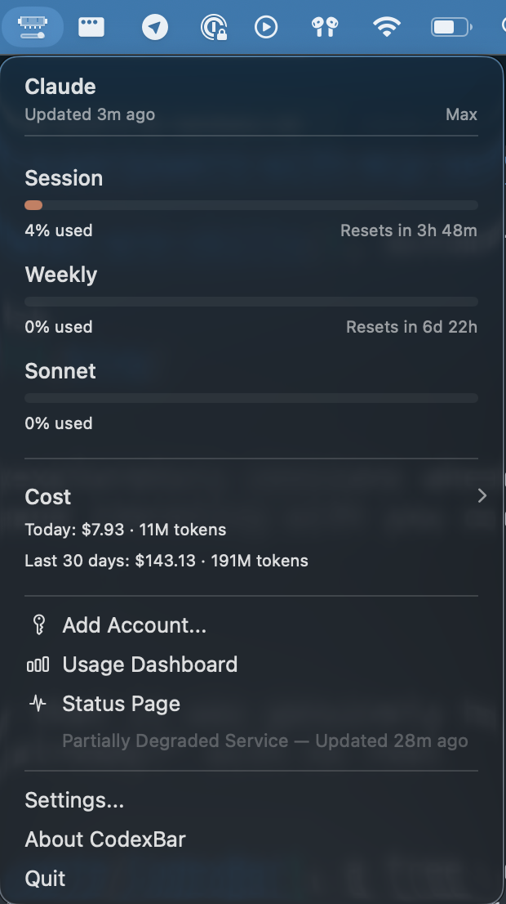

I'll just say it: I spend $100 a month on Claude.

When I tell people that, I can see the mental math happening. That's $1,200 a year. On an AI tool. For marketing. And I get it, that number sounds like a lot, especially when you're still figuring out whether this whole "Claude Code for marketers" thing is even for you.

But the real question isn't whether the Max plan is worth $100/month, it's whether *you* need it yet. And the honest answer for most marketers who are just getting started is that you probably don't.

## Why you need at least the Pro plan

Claude Code requires the Pro plan ($20/month, or $17/month if you pay annually) as a minimum. The free tier of Claude doesn't include Claude Code access, you don't get the best models, and you miss out on features like Research and Memory.

I genuinely believe that if you're using AI for work in any capacity, the paid tier pays for itself almost immediately. Even a single research task that saves you two hours of manual Googling has already returned the $20 investment easily. And with the Pro plan, you get Claude Code, access to the latest models, unlimited projects, Research mode for deep dives, and Memory so Claude actually learns your preferences over time.

Pro is the starting line. Everything I write about on this blog assumes you're at least on Pro.

## What the Max plan actually gives you

A lot of people get this wrong about Max: it doesn't unlock new features. You're not getting a secret, smarter version of Claude. Max gives you the same tools as Pro, just with 5x the usage.

That might sound anticlimactic, but the real benefit is more subtle than it appears. On Max, you stop thinking about limits and just work. There's no mental overhead of "should I start this research session now or save my usage for later?" No breaking a task into two sessions because you're worried about running out. You just open Claude Code and go.

For me, the shift happened gradually. I started on Pro and it was plenty for quick tasks like drafting social posts, editing blog copy and short brainstorms. But as I expanded into longer coding sessions, deep research, and [MCP-heavy workflows](/blog/giving-claude-code-superpowers-with-mcp-servers/), I started hitting usage limits regularly. At some point the friction of managing my usage became more expensive (in time and frustration) than the $80 upgrade.

## What burns through usage fast (and what doesn't)

Not all tasks are created equal when it comes to usage. Here's roughly what I've noticed from my own patterns:

**Low usage tasks:**
- Quick social media drafts
- Blog post edits and proofreading
- Short brainstorms and idea generation
- [Turning one piece of content into social posts](/blog/turn-one-piece-of-content-into-ten-social-posts/)

**High usage tasks:**
- Long research sessions (especially with Research mode)
- Anything involving [MCP servers](/blog/giving-claude-code-superpowers-with-mcp-servers/) (lots of back-and-forth token consumption)
- Extended coding sessions (building tools, [skills](/blog/what-are-skills/), automation workflows)
- Long-form draft generation with multiple rounds of feedback
- Sessions where you're using multiple [tricks and features](/blog/claude-code-tricks-i-wish-id-known-sooner/) together

Short, focused tasks are generally pretty low usage. Long, exploratory sessions where Claude is reading lots of context, calling external tools, and iterating with you over many turns start to add up.

## How to actually track your usage

For a while, one of my biggest frustrations with Claude was that it was genuinely hard to know how much you were using. You'd hit a limit and think "already?" with no real visibility into what consumed all your credits.

That changed when I found [CodexBar](https://github.com/steipete/CodexBar), a free menu bar app that sits in your Mac's top bar and shows you exactly what's happening including your current session usage, weekly totals, and estimated cost in dollars.

Having actual numbers changed how I thought about my usage entirely. Instead of guessing, I could see that a 45-minute research session cost roughly $X, while a quick blog edit was pennies. My real numbers are up in the screenshot above. It looks like I used about $143 of usage in the last month, which means the $100 flat rate is saving me money compared to what I'd spend on pay-as-you-go.

My recommendation is to install CodexBar on day one, even if you're on Pro. Having real data makes the "should I upgrade?" decision obvious instead of stressful.

## My honest take on whether Max is worth $100/month

For me, absolutely. I use Claude Code for so many different things across my marketing work that the value I get back is a multiple of what I pay. It's not even close.

But I also recognize that I'm a heavy user. I'm writing about this stuff every day, building skills, testing MCP servers, running research sessions, coding tools. That's not where most marketers start, and it shouldn't be.

The hidden cost of the cheaper plan isn't so much the dollar amount, but the context-switching tax. When you're on Max, you're paying for uninterrupted flow, not just more tokens.

## Start here

Here's what I'd tell any marketer trying to figure out which plan to pick:

1. **Start on Pro ($20/month).** It's enough for most marketers who are getting started. You get Claude Code, the best models, and all the features you need to follow along with everything on this site.

2. **Install CodexBar immediately.** Even before you think you need it. Having usage data from day one means you'll know exactly when (or if) you need to upgrade, based on real numbers instead of vibes.

3. **Use Claude Code for a couple weeks across your normal marketing tasks.** Don't artificially limit yourself, but don't go out of your way to burn credits either. Just use it naturally.

4. **If you're regularly hitting limits or waiting for resets, upgrade to Max.** At that point, you'll know you're getting enough value to justify the cost, because the usage data proves it. (There's also a $200/month tier with 20x usage for very heavy users, but the same logic applies: only upgrade if you're actually hitting limits.)

5. **If you're comfortably within Pro limits, stay there.** Save the $80/month and put it toward something else (like a [ChatGPT subscription](/blog/claude-code-vs-chatgpt-for-marketing/)). You can always upgrade later.

## The bottom line

The best plan is the one that lets you focus on the work, not the tool. For some marketers, that's Pro. For me, it's Max. Neither answer is wrong.

What matters more than which tier you pick is actually getting started. If you've been on the fence about trying Claude Code because you weren't sure about the cost, now you have a clear starting point: $20/month, and you can always adjust from there.

If you want to see what Claude Code can do for your marketing work, the [free 7-day email course](/start) is the fastest way to get started. Each lesson takes about 15 minutes and walks you through real marketing workflows. Drop your email below and I'll send you the first lesson right away!
