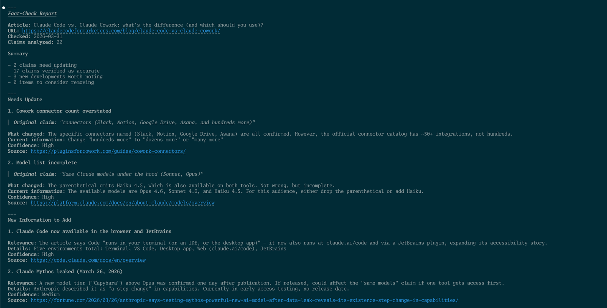

import EmailSignup from '../../components/EmailSignup.astro';

I published the [Claude Code vs. Cowork comparison post](/blog/claude-code-vs-claude-cowork/) about a week ago, and I was already second-guessing it. Had the connector count changed? Did Anthropic ship a new feature I missed? Was the pricing still right?

That post has maybe 20 verifiable facts in it. Things like pricing, launch dates, platform availability, and which features are included in which tier. And any one of them could quietly become wrong without me noticing.

Now multiply that by every comparison post, tool review, and statistics roundup on the site. The maintenance burden adds up fast, and I'll be honest: going back through old posts to check if the facts still hold is nobody's idea of a fun afternoon (or often, evening).

So I built a system to handle it for me. It's a Claude Code [skill](/blog/what-are-skills/) that reads any article, extracts every verifiable claim, researches whether each one is still accurate, and hands me a report with exactly what needs fixing. I'm giving it away for free at the end of this post (or you can grab it right now if you're impatient).

<EmailSignup
  formId="9274047"
  tagId="18523145"
  headline="Get the fact-check skill (free)"
  description="Download the Claude Code skill that audits any article for outdated facts. Drop it in your skills folder and run /fact-check on any URL."
  buttonText="Send me the skill"
/>

But first, let me convince you why this matters more than you think.

## Your best content is quietly going stale

HubSpot found that [76% of their monthly blog views](https://blog.hubspot.com/marketing/historical-blog-seo-conversion-optimization) came from old posts, but if those posts contain outdated information, that's a *lot* of readers getting the wrong picture.

And the decay happens faster than most people realize. [Animalz measured](https://www.animalz.co/blog/content-refresh) an average 1.2% weekly traffic loss once content starts decaying. That's roughly 5% of your traffic every month, not because the post is bad, but because it's becoming stale.

Comparison posts and pricing pages are the worst offenders. If your page says a competitor doesn't have a feature they actually launched three months ago, informed readers notice and once they catch an incorrect claim, they stop trusting the rest of the page too.

The frustrating part is that most of us *know* we should be updating our content. But according to [Semrush's State of Content Marketing report](https://www.semrush.com/state-of-content-marketing/), only 33% of content marketers audit their content even twice a year. It's tedious work, it doesn't feel as rewarding as creating something new, and nobody really owns the process.

## Why this matters more now

Content freshness has always been important for search rankings, but something has shifted in the last year. AI search platforms have made it *critical*.

[Ahrefs found](https://ahrefs.com/blog/fresh-content/) that AI-recommended content is 25.7% fresher on average than what shows up in organic Google results. ChatGPT and Perplexity aren't just pulling from the same old top-10 results, they're actively favoring content that's been recently updated. If your article hasn't been touched in six months, AI assistants are citing someone else's fresher take on the same topic instead of yours.

## The current solutions aren't great

I looked into what's available for keeping content fresh and wasn't impressed.

**Manual audits** are the default approach. Open a spreadsheet, list every URL, check each post by hand, note what needs updating. This works if you have five posts, but if you have fifty, it can take days or weeks (and the spreadsheet gathers dust before then).

**WordPress plugins** like Content Refresh Manager and ContentPulse will send you reminders when posts hit a certain age. That's helpful, but they're basically a calendar notification. They tell you something is old. They don't tell you *what* is wrong or help you fix it.

**Enterprise tools** like Quattr, AirOps, and MarketMuse can monitor content freshness, track AI citations, and flag decay. They're genuinely good. But they start at $200-500+ per month, which is overkill for a solo creator or small marketing team.

There's nothing affordable that actually *reads your content*, identifies which specific claims are outdated, and helps you fix them. So, that's what I built.

## The workflow: fact-checking your articles with Claude Code

I built a [skill](/blog/what-are-skills/) called `fact-check` that handles this end to end. Here's how it works.

**Step 1: Give it a URL.** Type `/fact-check` and paste the article URL. Claude fetches the page and reads through it, pulling out every verifiable claim: pricing, feature availability, launch dates, platform support, architectural details, comparison claims.

**Step 2: Review the claims.** Before doing any research, Claude shows you what it found, grouped by topic. Something like:

> **Claude Cowork (10 claims)**
> 1. [Hard] "Cowork launched in January 2026 as a research preview" (Date)
> 2. [Hard] "runs inside a sandboxed virtual machine" (Architecture)
> 3. [Hard] "extends through plugins and connectors" (Features)
> ...
>
> **Pricing (3 claims)**
> 8. [Hard] "Pro ($20/month)" (Pricing)
> ...

You can skip groups you know are fine and focus on the ones most likely to have changed. No point researching your site's founding date.

**Step 3: Parallel research.** This is where it gets good. Claude spins up a separate research agent for each claim group, all running at the same time. Each agent knows where to look first: official product pages and docs for feature claims, the actual pricing page for pricing claims, changelogs for version and release claims. Every finding comes back with a confidence level (high, medium, or low) and the source URL so you can verify it yourself.

**Step 4: The report.** Everything gets assembled into a structured report organized by what matters most:

- **Needs Update**: claims that are no longer accurate, with the current correct information
- **New Information to Add**: relevant developments the article doesn't mention yet
- **Consider Removing**: anything that's become misleading or irrelevant
- **Still Accurate**: confirmed claims (abbreviated, because you don't need a paragraph explaining that something is still true)

When I ran this on my [Cowork comparison post](/blog/claude-code-vs-claude-cowork/), it flagged that I'd said Cowork has "hundreds" of connectors when the actual number is closer to 50. It also noted that Claude Code now runs in the browser and via a JetBrains plugin, which my post didn't mention. Out of 22 claims, 17 checked out fine, 2 needed corrections, and 3 new developments were worth adding.

**Step 5: Make the fixes.** If your article lives as a local file (like my markdown blog posts), Claude can make the edits right there. If it's in [WordPress](/blog/hooking-claude-code-up-to-wordpress/) or [Google Docs](/blog/hooking-claude-code-up-to-google-docs/), it can use [MCP servers](/blog/giving-claude-code-superpowers-with-mcp-servers/) to edit it through those platforms. Or you can just take the report and make the changes yourself.

## Automate it so you never have to think about it

Once you've seen how the manual workflow works, you can set it up to run on a schedule.

Both Claude Code and Claude Cowork support scheduling. In Claude Code, you can set up scheduled agents that run on a cron schedule, so `/fact-check` runs against your key posts every month and notifies you when something needs attention. In Cowork, you can do the same thing through built-in scheduled tasks from the GUI, no terminal required.

Either way, it's the difference between "I should check those old posts" and getting a report telling you exactly what changed.

I'd say a reasonable cadence is monthly checks for comparison and pricing content (these go stale fastest) and quarterly for everything else. Don't try to audit your entire archive at once. Start with the posts that drive the most traffic and work outward from there.

## The ROI is real

I'll keep this short because the numbers speak for themselves.

HubSpot ran an experiment updating old blog posts and saw a [106% increase in organic search traffic](https://blog.hubspot.com/marketing/historical-blog-seo-conversion-optimization) on those posts, with more than double the monthly leads. Shopify refreshed a single post that had decayed to about 3,000 monthly visitors and [recovered it to over 35,000](https://www.contentharmony.com/blog/content-refresh-examples/). Hunter.io saw a 500% increase over seven months after refreshing an email follow-up guide.

The other thing worth noting: refreshed content typically recovers in 2-4 weeks after re-indexing, compared to 3-6 months for a brand new post to gain traction. Updating what you already have is faster than starting from scratch.

If you try it on your own content, I'd love to hear what it finds. Hit me up on [Twitter](https://twitter.com/kkoppenhaver) or [LinkedIn](https://linkedin.com/in/keanankoppenhaver) and let me know.
