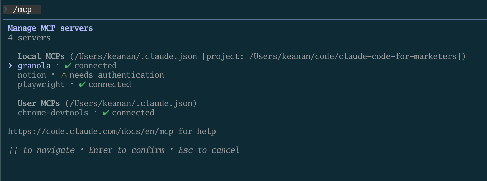
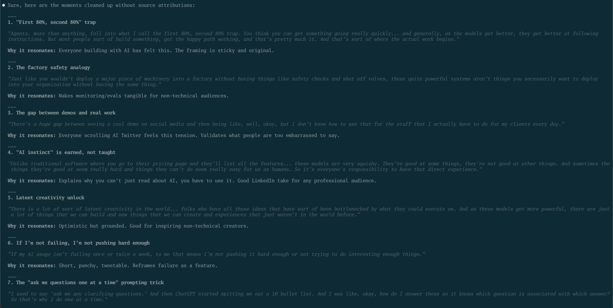

I used to think my biggest social media problem was coming up with things to say.

I'd sit down to write a LinkedIn post and just... stare. What do I have to say that's actually worth sharing? What angle hasn't been covered a thousand times? I'd scroll through other people's posts looking for inspiration, draft something half-hearted, delete it, and move on with my day.

Then I realized something: I'd already said three interesting things that morning. On a sales call. And a client call after that. I'd explained a concept in a way that made someone go "oh, that makes so much sense." I'd shared a framework that helped a prospect rethink their approach. I'd answered a question with an analogy that clearly landed.

But, all of that disappeared from my brain the moment I hung up.

Here's what I've come to believe: **most people don't have an ideas problem. They have a capture problem.** If you're on calls regularly, you're already sharing insights, opinions, and frameworks that would make great social media content. You're just not writing any of it down.

So I built a system to fix that. Using Claude Code, I can now pull up my recent call transcripts, have Claude scan through them for the ideas worth sharing, draft platform-specific posts, and schedule them. The whole process takes about 15 minutes, and the best part is that none of the _ideas_ came from AI. They came from me.

## The wrong way to use AI for social media

Before I get into the workflow, I want to talk about what *doesn't* work.

A lot of people open ChatGPT (or another tool) and type something like "give me 10 LinkedIn post ideas about marketing." And they get back ten ideas that sound like they were pulled from a 2019 marketing textbook. They're generic, corporate, and could've come from literally anyone.

When you give it nothing to work with, you get nothing worth posting.

The better approach is to feed it something you *actually said*, with your real opinions and real expertise already baked in, and let it distill that into something shareable. You're not outsourcing your thinking. You're just making sure the thinking you've already done doesn't go to waste.

<aside>

**If you're not transcribing your calls yet, start now.** Even if you don't do anything with the transcripts today, you're building a library of your own expertise that you can mine later. Every AI workflow starts with data, and your call transcripts are some of the richest data you have. Tools like [Granola](https://granola.ai), Otter, Fireflies, or even Zoom's built-in transcription all work. The tool doesn't matter as much as the habit.

</aside>

## Setting up the Granola MCP

I use [Granola](https://granola.ai) for my call transcription, and this is where the workflow gets really smooth. Granola has an MCP server, which means Claude Code can connect to it directly and pull your transcripts without any copy-pasting.

If you're not familiar with MCP servers, they're basically bridges that let Claude Code talk to external tools. I wrote a whole post about them: [Giving Claude Code superpowers with MCP servers](/blog/giving-claude-code-superpowers-with-mcp-servers). The short version is that they unlock a ton of useful integrations, and Granola's is one of my favorites.

Setting it up is a one-time thing. Open your terminal and run:

```bash
claude mcp add granola --transport http https://mcp.granola.ai/mcp
```

Then open a new terminal tab, start Claude Code, and type `/mcp`. Select the Granola MCP and choose "Authenticate." Your browser will pop open for a quick OAuth login, and you're connected.



That's it. From now on, Claude Code can access your meeting notes and transcripts directly.

## Finding the good stuff in your transcripts

This is the part I enjoy the most.

Once Granola is connected, I ask Claude Code something like:

> Can you look at my meetings from this week and find moments where I shared an insight, explained something well, or gave advice that might resonate on LinkedIn or Twitter?

Claude pulls up my recent transcripts through the Granola MCP and scans through them. It's not pulling out literal quotes (those tend to be rambly and full of "um" and "so basically"). Instead, it distills the key ideas into tight, shareable insights.

For example, after a week of calls, Claude might come back with something like:

- **On building trust with prospects:** You explained that the best way to earn trust isn't proving you know more than them, it's showing you've thought about their specific situation more than anyone else has.
- **On AI adoption:** You shared a framework about starting with "boring" automations before jumping to AI agents, and the prospect responded really positively.
- **On content strategy:** You made a point about how most companies are creating content for search engines instead of for the people who'd actually buy from them.



Three to five insights like this from a week of calls is pretty typical. And the more specific you can be with your initial prompt, the better the results. If you know what kinds of ideas tend to do well on your social channels (hot takes, frameworks, counterintuitive advice), tell Claude that upfront. Something like:

> Look specifically for moments where I challenged conventional thinking or shared a framework. Those tend to perform best for me on LinkedIn.

The key thing here is that **Claude isn't coming up with ideas from nothing.** It's finding ideas you already had and surfacing the ones worth sharing more widely.

## From insight to draft

Once I've picked the insight I want to run with, the next step is turning it into an actual post.

I use the `/linkedin` and `/tweet` skills from my [cc-skills repo](https://github.com/kkoppenhaver/cc-skills) for this. If you've read the [content repurposing article](/blog/turn-one-piece-of-content-into-ten-social-posts), you've seen these in action. They handle the platform-specific formatting (LinkedIn posts are structured very differently from tweets), and they have voice calibration built in so the output actually sounds like you, not like a corporate AI.

If you haven't used skills before, check out [What are skills (and why should marketers care)?](/blog/what-are-skills) for the full walkthrough. But the short version is: skills are reusable instructions you give Claude Code for specific types of tasks. The social media skills know about hook structures, post formatting, and how to match your writing voice.

So I'll say something like:

> Let's take that insight about building trust with prospects. Can you draft a LinkedIn post around that using /linkedin?

Claude generates a draft. I read it, give feedback ("make the hook punchier" or "add the specific example from the call"), and we iterate until it sounds right. Usually takes one or two rounds.

I find it helps to focus on one insight at a time rather than asking for five drafts at once. You end up with better posts when you give each one your full attention.

## Posting with the Typefully skill

The last step is getting the post scheduled, and this is where the whole pipeline really comes together.

The social media skills from the [cc-skills repo](https://github.com/kkoppenhaver/cc-skills) have Typefully scheduling built right in. [Typefully](https://typefully.com) is a tool for drafting and scheduling social media posts, and its API lets Claude Code create drafts directly from the terminal.

To set it up, you'll need a Typefully API key (you can find it in Typefully's Settings under API & Integrations) and your Social Set ID. Add both to your `~/.claude/settings.json` file:

```json
{
  "env": {
    "TYPEFULLY_API_KEY": "your-key",
    "TYPEFULLY_SOCIAL_SET_ID": "your-id"
  }
}
```

Once that's configured, you can tell Claude Code:

> Schedule this post in Typefully for tomorrow at 9am.

And it handles the rest. The skill calls Typefully's API to create a draft with your scheduled time, and the post goes out without you ever opening another app.

For anyone curious about how it works under the hood: the skill includes a Python script that talks to Typefully's API. It calls their drafts endpoint to create new posts, and you can set it to publish immediately or schedule for a specific time. If you want to build your own version or customize it, the [skills article](/blog/what-are-skills) walks through how skills are structured. But you don't need to understand any of that to use it. Just install the skill and tell Claude when you want to post.

If you don't use Typefully, that's totally fine. You can always copy the finished post into whatever tool you prefer (Buffer, Hootsuite, or just post it manually). The generation part of the workflow works the same either way.

## The full pipeline

Here's what the whole system looks like, zoomed out:

1. **Have your calls** (you're already doing this)
2. **Granola transcribes them** automatically in the background
3. **Ask Claude Code to scan your recent transcripts** via the Granola MCP
4. **Pick the insights** worth sharing
5. **Use `/linkedin` or `/tweet`** to draft platform-specific posts and schedule via Typefully, right from Claude Code

Total added effort on your part: about 15 minutes to pick insights, review drafts, and approve the schedule. The ideas were already there. You just needed a way to catch them.

## You don't need to be a "content creator"

I think there's a reason so many smart people struggle to post consistently on social media. They think they need to sit down and *create content* from scratch, as if that's a separate activity from the work they're already doing.

It's not.

If you're on calls every day talking to prospects, clients, and collaborators, you're already creating content. You're explaining things, sharing perspectives, making arguments, helping people understand something they didn't before. The ideas are flowing. They're just flowing into a Zoom call and disappearing.

This workflow doesn't ask you to become a content creator. It just makes sure the content you're already creating gets captured and shared with a bigger audience.

Start transcribing your calls this week. Connect Granola to Claude Code. Ask it to scan your last few days of meetings and see what it finds. You might be surprised how much you've been saying that deserved a bigger audience.

If you give this a try and create something you're proud of, I'd love to see it. Reach out on [Twitter](https://twitter.com/kkoppenhaver) or [LinkedIn](https://linkedin.com/in/keanankoppenhaver) and share what you came up with.
