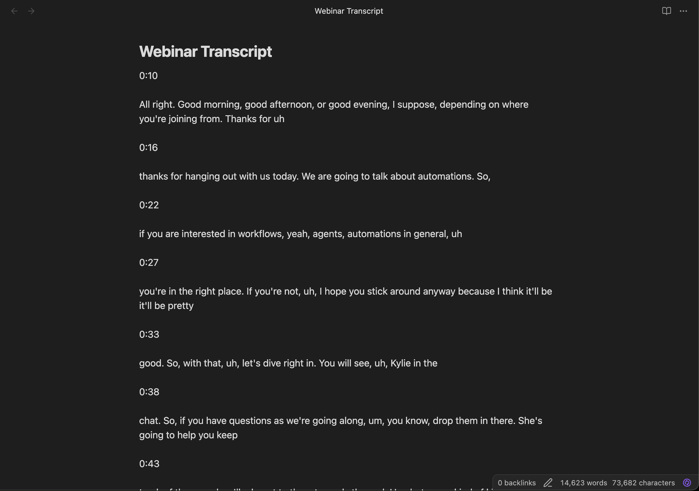
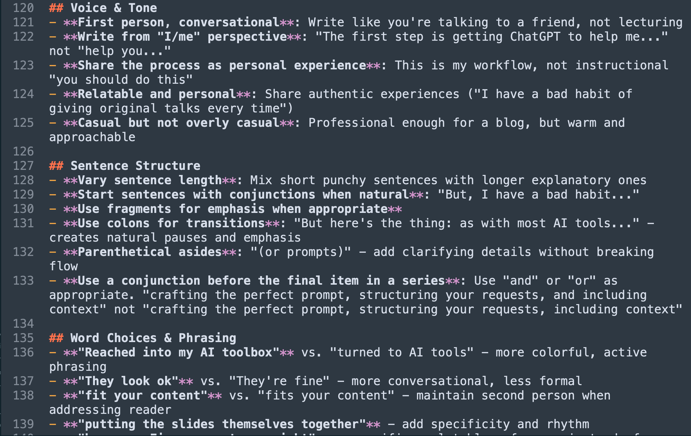

I recently hosted a webinar for Retool about designing automations. It was an hour long, covered a ton of ground, and I was really happy with how it turned out.

Then came the familiar feeling: **now what?**

The webinar was done, the recording was up on YouTube, and I knew there were at least a dozen great ideas buried in that hour of content that deserved to live somewhere other than a single YouTube link.

But turning one piece of content into multiple social posts has always felt like a grind. You watch the recording back, scribble down notes, try to remember what sounded smart, then stare at the blinking cursor wondering how to compress a nuanced idea into 280 characters.

So I tried something different. I used Claude Code to turn that single webinar into 10 social media posts across Twitter and LinkedIn, and the whole process took me about 30 minutes.

Here's exactly how I did it.

## Start with your source content

The first step is the easiest: **pick the content you want to repurpose.**

This works with pretty much anything:

- A webinar recording (that's what I used)
- A blog post you've written
- A podcast episode
- A conference talk
- Even a long email or sales call that was surprisingly insightful

The key here is that you've already done the hard thinking. You just need to extract those ideas them and repackage them.

## Get a transcript

If your source content is audio or video, you'll need a transcript first. Claude Code works with text, so we need to get your ideas into a format it can read.

For a blog post or written content, you can skip this step entirely. You've already got text.

For my webinar, I grabbed the auto-generated transcript from YouTube. It wasn't perfect (it never is), but it captured all the key ideas, and that's what matters.

Once you have your transcript, save it as a text file somewhere on your computer. You might want to [store it in Obsidian](/blog/obsidian-as-your-second-brain/), or just in its own project folder. I dropped mine on my desktop and named it `webinar-transcript.txt`.

## Dial in your voice first

Here's where most people go wrong with AI-generated content. They skip straight to "make me 10 LinkedIn posts" and end up with generic, corporate-sounding output that doesn't sound like them at all.

**Before you generate a single post, you need to make sure Claude Code knows how you write.**

This is the difference between content that sounds like a robot wrote it and content that sounds like you on a good day. There are a couple of great tools for this:

- **[Spiral](https://spiral.computer)** (from the folks at Every) can analyze your existing writing and create a "voice" that maps how you naturally write.
- **[YourVoiceProfile.com](https://yourvoiceprofile.com)** is another option specifically designed for this!

Both of these tools look at content you've already published and distill your writing patterns: how you structure sentences, what kind of vocabulary you use, whether you're formal or casual, and more.

Once you have a voice profile, you can add it to your `CLAUDE.md` file (that's the file that tells Claude Code about your preferences) or incorporate it into a skill. If you're not sure what skills are, I wrote a whole piece about them that you should take a look at: [What are skills (and why should marketers care)?](/blog/what-are-skills/)

The short version is: skills are like little instruction manuals you give to Claude Code for specific tasks. And the ones we're about to use have voice calibration built right in.

## Brainstorm before you execute

This is my favorite part of the workflow, and it's the step that makes everything else better.

**Don't just tell Claude Code to "make 10 posts." Have a conversation first.**

Open up Claude Code (that's the terminal application, just open it like you would any app) and give it your transcript. You can say something like:

> I just hosted a webinar about designing automations. Here's the transcript. Can you read through this and pull out the key ideas and themes that could work as standalone social media posts?

Claude Code will come back with a list of themes and ideas it found interesting. For my webinar, it pulled out things like:

- The progression from simple automations to AI agents
- Why most companies should start with deterministic workflows before jumping to AI
- The "lead enrichment" example as a concrete use case people could relate to
- A counterintuitive point about when NOT to use AI agents

Now here's the magic: **you get to have a back-and-forth about this.** You might say:

> I like ideas 1 and 3, but idea 4 is actually the most interesting one. Can you think of a few angles we could take on that? Also, I think there's a point I made around the 20-minute mark about starting simple that could resonate with people who feel overwhelmed by AI.

This brainstorming conversation takes maybe 5 minutes, and it means you're actively curating which ideas deserve to become posts.

**Think of it like briefing a really smart intern.** You wouldn't hand someone a transcript and say "make posts." You'd talk through what matters, what angle to take, what the audience needs to hear.

## Generate platform-specific posts with skills

Now we get to the fun part.

I've put together a set of skills that I use specifically designed for generating social media content. They're free and open source, and you can grab them from the [cc-skills repo on GitHub](https://github.com/kkoppenhaver/cc-skills).

The two you'll want for this workflow:

- **`/tweet`** for generating Twitter/X posts
- **`/linkedin`** for generating LinkedIn posts

Each skill includes:

- **Voice calibration** so the output sounds like me
- **Platform-specific structures** (because what works on Twitter is very different from LinkedIn)
- **A preflight checklist** that makes sure you've given it enough context before generating
- **A postflight checklist** that reviews the output for quality before you publish

If you haven't installed skills before, check out [the skills article](/blog/what-are-skills/) for a walkthrough. Otherwise, clone the repo and Claude Code can use them like built-in commands. You'll want to update the voice in these particular skills to fit how _you_ post.

Once you've got the skills installed and you've had your brainstorming conversation, you can start generating. Something like:

> Using the 6 ideas we brainstormed, can you generate Twitter posts for ideas 1, 3, and 4 using /tweet, and LinkedIn posts for ideas 2, 5, and 6 using /linkedin?

Claude Code will use each skill to generate platform-appropriate content. The tweet skill knows about character limits, hook structures, and thread formatting. The LinkedIn skill knows about the different pacing, the storytelling format that works there, and how to structure longer-form posts.

Here's what I love about this approach: **you end up with posts that are actually different from each other.** Instead of just the same idea copy-pasted with minor tweaks, you get genuinely different angles on your source content, tailored to how each platform works.

For my webinar, I ended up with:

- 4 tweets (two standalone, one thread, one with a hot take angle)
- 3 LinkedIn posts (one storytelling format, one tactical breakdown, one asking a question to drive engagement)
- 3 Twitter posts that linked back to the webinar recording with different hooks

That's 10 posts from one webinar. And they actually sound like me.

## Review and refine

I want to be honest here: **not every post comes out perfect on the first try.** And that's fine.

Sometimes a tweet is almost there but the hook needs work. Sometimes a LinkedIn post nails the structure but uses a phrase you'd never actually say. This is where your editorial judgment matters.

Read through everything Claude Code generates. You'll probably want to:

- **Tweak a few words** here and there to make things feel more natural
- **Cut anything that feels generic** or like it could have been written by anyone
- **Add specific details** that only you would know (a behind-the-scenes moment, a reaction you got from the audience)
- **Rearrange the order** of some posts to build a narrative across your social feeds

This review step usually takes me about 10 minutes. Which, combined with the brainstorming and generation, puts the whole workflow at roughly 30 minutes for 10 posts.

Way better than staring at a blank screen trying to come up with 10 different angles on your content.

## Schedule everything via Typefully

The last piece of the puzzle: getting these posts actually published.

The tweet and LinkedIn skills from the [cc-skills repo](https://github.com/kkoppenhaver/cc-skills) have **built-in Typefully scheduling scripts.** Typefully is a tool that lets you draft, schedule, and publish social media content, and it has a great API that Claude Code can talk to.

This means once you've reviewed and approved your posts, you can tell Claude Code:

> Schedule these posts in Typefully, spacing them out over the next two weeks.

And it will handle the scheduling for you. No copying and pasting into a separate tool. No manually setting dates and times. It just flows from generation to scheduling in one smooth process.

If you don't use Typefully, that's totally fine. You can also just copy the posts into whatever scheduling tool you prefer (Buffer, Hootsuite, or even just post them manually). The generation workflow works the same either way.

## The full workflow at a glance

Let's take a look back at what we built so far, because it's simpler than it might seem:

1. **Pick your source content** (webinar, blog post, podcast, whatever)
2. **Get a transcript** if it's audio/video
3. **Set up your voice** using tools like Spiral or yourvoiceprofile.com (you only do this once)
4. **Brainstorm with Claude Code** to identify the best ideas
5. **Generate posts using /tweet and /linkedin skills** from the [cc-skills repo](https://github.com/kkoppenhaver/cc-skills), combined with the voice guidelines you generated earlier.
6. **Review and refine** the output (10 minutes)
7. **Schedule via Typefully** or your preferred tool

Total time: about 30 minutes. And in the end, you've got 10 platform-specific social posts that actually sound like you.

You're still the one deciding what's worth saying. Claude Code just helps you say it in 10 different ways, optimized for 10 different contexts. And because the skills handle the platform-specific stuff (character limits, formatting, post structure), you get to focus on what actually matters: **the ideas.**

## Try it with your next piece of content

Here's my challenge to you: take your most recent webinar, blog post, or podcast episode and run it through this workflow. You just need Claude Code, the [skills from the repo](https://github.com/kkoppenhaver/cc-skills), and about 30 minutes.

If you're new to skills, start with [What are skills (and why should marketers care)?](/blog/what-are-skills/) to get the background. Then come back here and try this workflow.

I think you'll be surprised how quickly you go from "I have one piece of content" to "I have two weeks of social posts ready to go."

The brainstorming conversation alone is worth it. Even if you end up writing the posts yourself, having Claude Code pull out themes and angles from your content is like having a creative collaborator who actually listened to your entire webinar.

Give it a try. I'd love to hear how it goes.
