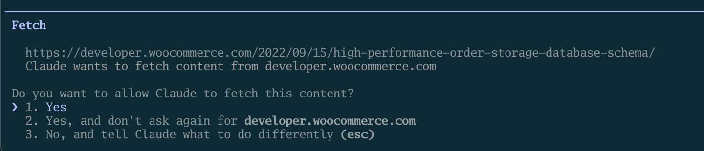

I was running a content repurposing workflow the other day. Claude Code was taking one blog post and turning it into a LinkedIn post, two tweets, an email teaser, and a short-form video script. I'd done this before, so I knew exactly what it was going to do.

And yet, every 30 seconds: "Can I create this file?" Yes. "Can I read this file?" Yes. "Can I run this command?" Yes. I was clicking approve over and over like a human rubber stamp.

That's when I went looking for a way to just let Claude *work*. And I found a flag called `--dangerously-skip-permissions`.

The name alone made me pause. But once I understood what it does (and what it doesn't), it became one of my most-used settings for specific types of work.

## First, a quick refresher on permissions

By default, Claude Code asks for your approval before it does anything meaningful. Creating a file? It asks. Running a terminal command? It asks. Editing a document? It asks.

This is the safety net, and for most of the work you do, it's exactly the behavior you want. Claude can't accidentally delete a folder full of client work or run some unexpected command without you explicitly saying "go ahead." You're always in control.

If you've used Claude Code for a while, you've probably noticed that you can also pre-approve certain types of actions. You can tell it "yes, you can always edit markdown files in this project" or "yes, you can always run npm commands." This lets you skip the prompts for things you trust while keeping the guardrails on for everything else.

That middle ground works great for most people. But there are situations where even that isn't enough.

## So what does `--dangerously-skip-permissions` actually do?

It's a flag you add when you launch Claude Code, like this:

> `claude --dangerously-skip-permissions`

When you run Claude Code this way, it stops asking for permission entirely. It just executes whatever it decides to do.

The word "dangerously" is in the name on purpose. Anthropic chose that word so you'd think twice before using it. It's the equivalent of a warning label on power tools: yes, you can take the safety guard off, but you'd better know what you're doing.

With this flag on, Claude Code will create files, delete files, run commands, and do whatever else the task requires without checking in with you first. And that's powerful when you trust the workflow, but it's risky when you don't.

## When it's genuinely useful

There are a few scenarios where skipping permissions makes sense.

**Automated workflows you've already tested.** If you've built a content workflow (like my repurposing example above) and you've run it manually a few times, you know pretty much what Claude is going to do. Approving each step individually at that point is just busywork. You've already validated the process, and now you want it to run without you babysitting it.

**Batch operations.** Maybe you need to update the formatting on 50 blog posts or generate social copy for every article in your archive. If you've tested the operation on a few files, you can be confident in the output, whereas running it across all 50 files with a permission prompt for each one would take forever.

**Background tasks.** If Claude Code is running as part of a larger automated setup (maybe it kicks off on a schedule, or it's triggered by some other tool), there's no human sitting there to click approve on the various actions. The whole point of automation is that it runs on its own.

In all three cases, the common thread is the same: **you've already verified what Claude is going to do, and you trust the process.**

## When you should NOT use it

**When you're trying something new.** If you haven't run this particular workflow before, keep the permission prompts on. In this case, these prompts are a window into what Claude is actually doing. Watching it ask "Can I create a file called social-posts.md?" teaches you how it thinks. If you skip that learning, especially for something you're going to repeat, you miss out on valuable learning.

**On files you can't afford to mess up.** If you're working in your main project folder, on client deliverables, or anything where a mistake would mean real pain,  keep the guardrails on. The few seconds you spend approving each action is cheap insurance.

**When you're still building confidence.** If you're relatively new to Claude Code, the permission prompts are genuinely educational. They show you the steps Claude takes to accomplish a task, which helps you build a mental model of how it works. Once you have that mental model, you can make better decisions about when to trust it. But you need the prompts to build that understanding in the first place.

## The safer middle ground

If you like the idea of fewer interruptions but `--dangerously-skip-permissions` feels too aggressive, there's a middle path.

Claude Code lets you create an allowlist of pre-approved actions. Instead of approving *everything* or approving *nothing*, you can say:

- "Always allow editing markdown files in this project"
- "Always allow running this specific command"

This way, the repetitive approvals go away for actions you trust, but Claude still checks in for anything outside your approved list. It's the best of both worlds for most workflows.

You set this up directly in Claude Code. When a permission prompt comes up, you'll see options to allow it just this once, for the whole session, or permanently for the project.

Over time, your most common actions get pre-approved and the interruptions naturally decrease.

## The bottom line

The permission system isn't there to slow you down. It's there to keep you in the loop. And for most of the work I do, I *want* to be in the loop. I want to see what Claude is doing, approve the important steps, and stay aware of what's changing.

But for those workflows I've run dozens of times? That's when `--dangerously-skip-permissions` earns its place.

Start with the guardrails on. Graduate to pre-approving specific actions as you build trust. And only reach for the skip-permissions flag when you've genuinely verified the workflow and you're ready to let Claude run on its own.

The flag is there for a reason. The scary name is also there for a reason. Both are doing their job.

If you want more ways to customize how Claude Code works for you, check out the [CLAUDE.md masterclass](/blog/the-claude-md-masterclass/) for teaching Claude your preferences, or [4 tricks I wish I'd known sooner](/blog/claude-code-tricks-i-wish-id-known-sooner/) for other workflow improvements. And if you have questions about anything else Claude Code, reach out on [LinkedIn](https://linkedin.com/in/keanankoppenhaver).
