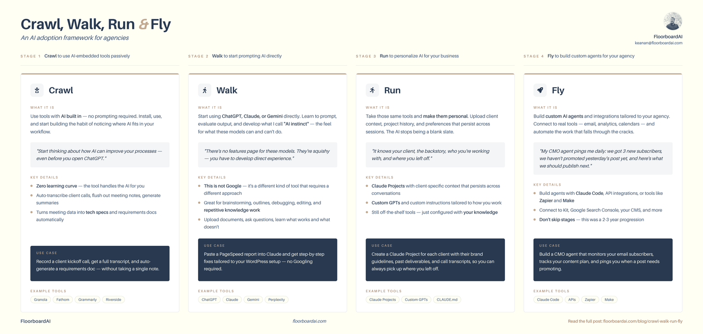

A few weeks ago, I was finishing up a pillar post for my agency about how agency owners should actually adopt AI — a [Crawl, Walk, Run, Fly framework](https://floorboardai.com/crawl-walk-run-fly-a-practical-ai-adoption-framework-for-agencies/) I've been teaching clients for a couple of years. The post needed an infographic. Not a hero image, an actual four-stage visual that could live on its own as a download.

The old version of this moment was always the same. Either I'd open Canva and spend two hours slapping something together that looked okay, or I'd pause the post entirely and wait on a designer. Either way, whatever momentum I had on the writing was gone.

This time I tried something different. I fed the pillar post and my brand guidelines into Claude Code and asked it to build the infographic as an HTML page.

Less than an hour later, I had something I was willing to ship. I iterated in plain English ("actually we don't need a link in the footer," "can you make all these boxes the same height," "let me see a totally different layout"). The loop was fast enough that I experimented with a couple of visual directions just to see what worked.

Instead of being the thing that blocked the post from going out, the infographic shipped alongside it and became a downloadable lead magnet on its own. And just like I might hand the copy to an editor, if I'd wanted to polish the graphic further, I could have handed it to a real designer for a final pass.

The infographic from that session, built entirely by Claude Code.

At the time, I didn't call this "vibe marketing." But a couple weeks later, seeing the term bounce around X for the hundredth time, I realized that's exactly what I was doing.

## So what is vibe marketing?

If you've spent any time on tech X lately, you've probably seen [vibe coding](/blog/vibe-coding-for-marketers/), the style of working where you describe what you want in plain English and let an AI agent build it for you. You're not reading the code. You're looking at the output, giving feedback, and iterating until it's right.

Vibe marketing is the same idea, pointed at marketing work instead of software.

**Vibe marketing is using tools that let you work and iterate very quickly to build and ship marketing assets based on vibes.** You describe what you want, you look at what comes back, and you steer. In vibe marketing, the agent handles the workflow and the execution and you're the creative director.

The infographic story above is vibe marketing. So is iterating on ad creative and copy until the visual actually looks right. So is putting together a slide deck by feel, or [turning one piece of content into ten social posts](/blog/turn-one-piece-of-content-into-ten-social-posts/) in a single session.

## It's a workflow, not a prompt

The part that matters most, and the part I think a lot of people miss when they hear "vibe marketing," is that it's not the same thing as "using AI to do some marketing."

If you ask ChatGPT to draft one email, that's using AI. If you generate a single hero image in Midjourney, that's using AI. Both are useful. Neither one is what I'd call vibe marketing.

What makes it *vibe* marketing is that the agent carries the whole workflow, start to finish, and you're guiding from the output side through multiple turns and iterations. All with a shipped asset at the end of it, not a generation you paste somewhere else.

Vibe coding has the same shape, applied to software. You're not staring at the code in the editor, you're reacting to the output and steering. Swap "code" for "marketing asset" and you've got vibe marketing.

## What else counts

Once you have the workflow lens, vibe marketing starts showing up all over your week. Some examples from mine:

**Ad creative iteration.** I describe the ad I want (audience, offer, tone) and ask Claude Code to produce copy plus a visual layout. Then I iterate: "this is too corporate," "try a more playful voice," "what if the headline led with the objection instead of the benefit?" In half an hour I have three or four variants to test, all from the same session.

**Motion graphics and short videos.** Using [HyperFrames](https://www.linkedin.com/feed/update/urn:li:activity:7451759171764400128/), an agent-native video tool, I can describe a scene (timing, captions, what's on screen) and watch it render. Adjust the timing, swap the copy, change the music, and re-render. Same workflow shape as everything else.

**Slide decks.** Describing a deck in plain English and letting Claude Code build the HTML version. Edit the headlines, swap sections, and reorder the flow without ever opening Keynote.

**Infographics and reference docs.** The full breakdown is in [why I stopped using AI image generators for infographics](/blog/why-i-stopped-using-ai-image-generators-for-infographics/), but the short version is that code is dramatically easier to iterate on than pixels when the asset has real content in it.

**A [brand guide](/blog/create-a-brand-guide-with-devtools-mcp/) that actually gets used.** Point Claude Code at your own site, have it extract the visual identity, and package it into a reusable reference. That brand guide is what made the opening infographic possible in the first place.

The common thread: the agent is doing the building. You're doing the deciding.

## It's not a "free marketer" card

Fair warning here, because there's a lot of hype on this topic and I don't want to add to it.

Vibe marketing doesn't replace marketing instincts, product knowledge, or opinions. It accelerates them. If you don't bring those to the table, the tools can't fake them.

If you don't have strong opinions about your brand, your audience, and what good looks like, the output you get from any vibe marketing workflow is going to be generic AI slop, because as good as the tools are, they can only get you to the thing you described. A vague description generates a vague result.

If you don't know your own product well, it's easy to get things that look great and don't actually make sense. Like an infographic that happens to misrepresent how your feature works, or a landing page that sells a benefit you don't actually deliver.

So no, **vibe marketing is not a free marketer card, just like vibe coding doesn't replace developer experience.** You still have to bring the taste, the brand judgment, and the willingness to say "that's close but not it" until the output matches what you had in mind. The tool just makes the iteration fast enough that your judgment gets to show up more often.

## If this sounds like how you want to work

The fastest way to find out whether vibe marketing fits the way you work is to try one asset. Pick something you were already planning to make this week (an infographic, a slide, an ad variant, or a simple social graphic) and run it through Claude Code instead of reaching for your usual tool. See what the iteration loop feels like. See how quickly you can go from "I want this" to "that's shippable."

If you're not there yet with Claude Code itself, that's exactly the reason I built a free 7-day email course. It walks you from "I've never opened a terminal" to "I'm running real marketing workflows with Claude Code." Sign up below, or if you want to jump straight in, [Don't be scared of the terminal](/blog/dont-be-scared-of-the-terminal/) is where I'd start.
