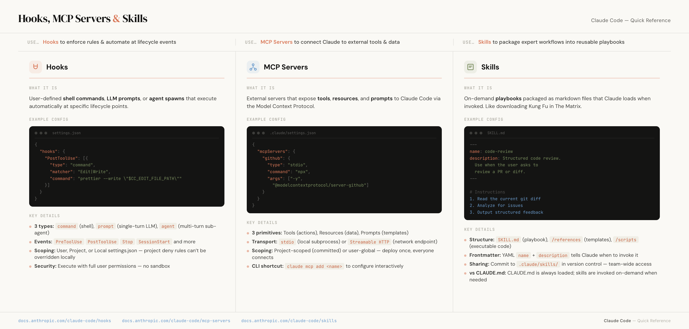

They have the same content. The same three-column layout. Same information about Claude Code's Hooks, MCP Servers, and Skills features.

This first image was generated by an AI image model. The one below it was built by Claude Code.


<p class="image-caption">Generated by an AI image model (Nano Banana)</p>


<p class="image-caption">Built as HTML by Claude Code</p>

The difference is hard to miss. One has garbled code snippets, made-up descriptions ("Managed Compute Platform" instead of "Model Context Protocol"), and text that's barely readable at normal zoom. The other has pixel-perfect typography, accurate code examples with syntax highlighting, and every single detail exactly where it should be.

Both images took me about the same amount of time to make and when I needed to change something, I could actually change it.

## Everyone freaked out about Nano Banana

When Google's Nano Banana model started generating infographics, my Twitter feed lost its mind. And the demos looked incredible. People were generating polished-looking one-pagers, data visualizations, and reference guides with a single prompt. It felt like a genuine unlock for anyone who's ever struggled to make something look good in Canva.

I got excited too. I tried it. And the first results were genuinely impressive for a first pass.

But then I tried to actually *use* the output. If I needed to fix a typo, change a color to match my brand, update a number or move a section down, every single change meant regenerating the entire image from scratch, hoping the model wouldn't break the three things I already liked about the previous version.

That's when I started wondering if there was a completely different approach.

## The fundamental problem with image-model infographics

The core issue is that you're describing what you want in words and hoping the model interprets it correctly. That works fine for creative imagery where "close enough" is good enough. These are _image_ models after all, the excel at creating imagry. But infographics are full of precise details: specific numbers, exact brand colors, code snippets that need to be syntactically correct, and text that needs to be spelled right.

Even the best image models still struggle with a lot of this. Text rendering is unreliable (misspellings, weird letter spacing, characters that look almost right but aren't). Layout control is basically nonexistent ("move the chart up a little" is a coin flip). And every iteration is a full re-generation, so you lose things you liked about the previous version while trying to fix one thing you didn't.

You can get something that looks 80% right pretty fast. But that last 20% is where you lose _hours_.

## Code is easier to control than pixels

When Claude Code generates an HTML page, every element on it is explicit and editable. A heading is a heading. A color is a hex code. There's nothing ambiguous about it.

"Move this chart up 20px" is a CSS change instead of requiring a complete regeneration, which means you can iterate on one section without touching the rest. Fonts, colors, spacing, and data are all exact, not approximated. And if you have a [brand guide](/blog/create-a-brand-guide-with-devtools-mcp/) already, Claude can match it precisely.

**For information-dense documents, code gives you more control than image generation ever will.** And you don't need to know how to write that code yourself, because we have Claude Code to help with that.

## An actual example: a training cheatsheet

I needed a one-page reference document covering three Claude Code features (Hooks, MCP Servers, and Skills). Basically, the kind of thing you'd hand someone after a training session so they have something to refer back to.

Instead of opening Figma or trying to prompt an image generator, I asked Claude Code to build it as an HTML page. But before writing any code, I had Claude Code use the Chrome DevTools MCP to crawl Anthropic's website and extract their visual identity: the color palette, typography system, spacing tokens, and component patterns. It assembled all of that into a design system reference that it could then use as a foundation for the cheatsheet. (If you've read my post on [building a brand guide with the DevTools MCP](/blog/create-a-brand-guide-with-devtools-mcp/), it's the same idea, just pointed at someone else's site instead of my own.)

From there, I gave it the content direction:

> Build me a one-page cheatsheet covering Hooks, MCP Servers, and Skills. Three columns, one per feature. Each column should have a brief description, a code example, and key details as bullet points. Use the Anthropic brand system you just extracted.

What Claude Code produced was a single, self-contained HTML file. No dependencies, no build step, just open it in a browser. It had a three-column layout with code examples featuring syntax highlighting, SVG icons for each feature, a "decision bar" at the top summarizing when to use each one, and brand-consistent typography throughout, all pulled from the design system it had built minutes earlier.


<p class="image-caption">The finished cheatsheet, built entirely with HTML and CSS</p>

The whole thing is just HTML and CSS. That's it.

## Iteration is where this approach shines

This is where the gap between image generation and code becomes impossible to ignore.

With an image generator, "make the code blocks darker" means regenerating everything and hoping it doesn't break something else. With HTML, Claude Code just changes `background: var(--slate-dark)` in one CSS rule. The code blocks get darker. Everything else stays exactly the same.

I also used the [DevTools MCP](/blog/giving-claude-code-superpowers-with-mcp-servers/) so Claude Code could see its own work in Chrome and fix rendering issues without me having to screenshot and describe problems back to it. Claude could look at the page, spot something that didn't look right, and fix it, all in the same conversation.

Each iteration touches only what needs to change. That's the whole point.

## Print stylesheets: the secret weapon

Here's the part most people don't know about. CSS has a feature called `@media print` that lets you define styles specifically for when a page is printed (or saved as a PDF). With a few lines, Claude Code set up the cheatsheet for clean export:

```css
@media print {
  @page {
    size: letter landscape;
    margin: 0.4in;
  }

  body {
    min-height: auto;
    background: white;
    print-color-adjust: exact;
  }

  .header { padding: 0 0 0.6rem; }
  .columns { padding: 0; }
  .footer { padding: 0.5rem 0 0; }
}
```

That's it. The page size is set to letter landscape, margins are tightened, padding is adjusted for print, and `print-color-adjust: exact` makes sure the dark code blocks and colored icons actually show up in the PDF instead of being stripped out by the browser's default "save ink" behavior.

Hit Cmd+P, save as PDF, and you have a pixel-perfect document that looks like it came out of a design tool. No export plugin, no paid subscription, and no fighting with Canva's PDF export settings.

## When to use which approach

Image generators are great for creative, artistic imagery where vibe matters more than precision: mood boards, social media visuals, and hero images for blog posts.

But for **information-dense documents** (infographics, cheatsheets, reference guides, data visualizations, anything with precise text and numbers) the Claude Code HTML approach gives you something image generators can't: control.

And here's the real kicker: **next quarter, I can update this cheatsheet by changing a few lines of HTML** instead of regenerating the whole thing from scratch. The content lives in code, which means it's versioned, diffable, and maintainable. Try doing that with a PNG from an image generator.

## Give it a try

Next time you need to create a reference document, a one-pager, or an infographic, try asking Claude Code to build it as an HTML page instead of reaching for an image generator. Iterate in the browser until it looks right. Then add a print stylesheet and export.

You might be surprised how much better the results are when you're working with code instead of pixels, even if you've never written a line of code yourself.
